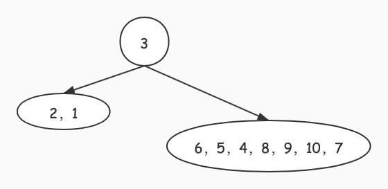
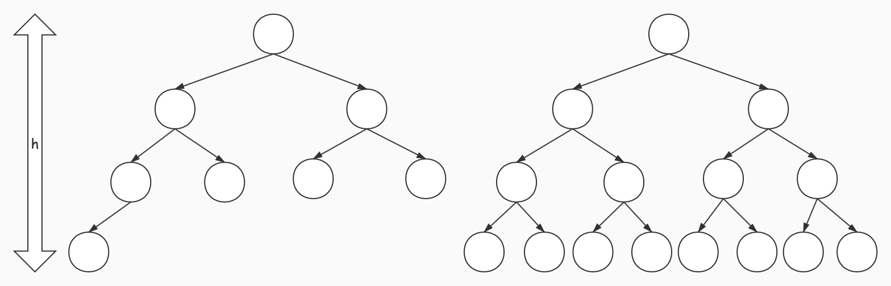
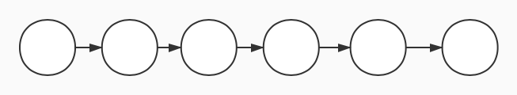

# 结合二叉树的快速排序算法分析

## 1. 示例引出：

__对 3，9，1，6，5，4，8，2，10，7 进行从小到大的快速排序__

对于第一次遍历，如下图所示：

对应的二叉树结果是：

那么经过后几次遍历比较可以得到如下二叉树：

这时我们可以计算一下我们的快速排序算法进行了多少次比较:

$1*2+2*3+3*3+4=21$，即每个节点到根结点的距离之和。

## 2. 快排算法复杂性分析：

由上例可知，快排可视为一个二叉树构建的过程，那么这个二叉树构建的速度就决定了我们快排的效率。可以确定的是，对于同样的数据元素在不同的原始排列条件下，构建的二叉树越矮，则排序效率越高。

通过这一理论，我们可以更具体的分析其不同情况下的时间复杂度：

* 对于最理想的状态，构建出的是一颗完全二叉树。

  完全二叉树满足如下公式：

  > $2*叶子到根的距离之和=顶点数+顶点到根的距离之和-1$

  对于深度为`h`的完全二叉树，若为满二叉树，比较次数为：$\sum_{i=1}^h(i-1)2^{i-1}=(h-2)2^{h}+2$

  这里的叶子数量`m`与深度`h`的关系：

  $2^{h-2}+1\leqslant m\leqslant 2^{h-1}$

  

  那么叶子到根的距离`d`为：

  $h-2\leqslant d\leqslant h-1$

  即，$log_2(m-1)\leqslant d\leqslant \log_2(m)$，由于$d$为整数，即可认为$\lfloor log_2(m)\rfloor \leqslant d \leqslant \lceil \log_2(m) \rceil$

  而对于完全二叉树来说，叶子数$m$，与内点（带有叶子节点的顶点）数$p$的关系为$p=m-1$，则顶点数$n=2m-1$

  那么由上述公式可得：

  > $比较次数=顶点到根的距离=2*叶子到根的距离-顶点数+1=m*log_2(m)-n+1\approx n\log_2(\frac{n}{2})-n+1$
  >
  > 即，$n\log_2(n)-2n+1$，时间复杂度为：$O(n\log(n))$。

* 对于最糟糕的状态，构建出的是一张线性表。

  那么若节点数为$n$，则：

  >  $比较次数=\sum_{i=0}^{n-1}i=\frac{n(n-1)}{2}$，即时间复杂度为：$O(n^2)$。

  

  * 对于平均情况而言，我们将$T_n$作为对$n$个对象进行快速分类时平均比较次数，在取得排序结果后，选取第$k$个元素为分割标准，平均比较次数为：$(n-1)+T_{k-1}+T_{n-k}$。

    由于分割标准的选取概率完全相同，那么可以得到平均比较次数为：

    > $平均比较次数=T_n=\frac{1}{n}\sum_{k=1}^n(n-1+T_{k-1}+T_{n-k})$
    >
    > $T_0=0\ \ T_1=0\ \ T_2=1$

    由于这里的$\sum_{k=1}^nT_{k-1}=\sum_{t=0}^{n-1}T_t,\ k=t-1$，以及$\sum_{k=1}^nT_{n-k}=\sum_{t=n-1}^0T_t=\sum_{t=0}^{n-1}T_t,\ k=t-1$

    > $T_n=n-1+\frac{2}{n}\sum_{k=0}^{n-1}T_k$
    >
    > $T_0=0\ \ T_1=0\ \ T_2=1$

    由$nT_n=n(n-1)+2\sum_{k=0}^{n-1}T_k$，以及$(n+1)T_{n+1}=(n+1)n+2\sum_{k=0}^{n}T_k$，得：

    > $\frac{1}{n+2}T_{n+1}-\frac{1}{n+1}T_{n}=2(\frac{2}{n+1}-\frac{1}{n+2})=d_n$

    令$S_n=\frac{1}{n+1}T_n$，得：

    > $Sn=2\sum_{i=0}^{n-1}(\frac{2}{i+1}-\frac{1}{i+2})$

    令$i=k-1$，得：$\sum_{i=0}^{n-1}\frac{2}{i+1}=2\sum_{k=1}^{n}\frac{1}{k}$

    令$i=k-2$，得：$\sum_{i=0}^{n-1}\frac{1}{i+2}=\sum_{k=2}^{n+1}\frac{1}{k}$

    整理得：

    > $S_n=2\sum_{k=2}^{n}\frac{1}{k}+4-\frac{2}{n+1}$

    由$\sum_{k=2}^n\frac{1}{k}<\int_{1}^{n}\frac{1}{x}dx=\ln(n)$，故$S_n<2\ln(n)+O(1)$

    则：

    > $T_n<2(n+1)\ln(n)+O(n)$
    >
    > 即，$T_n\sim O(n\log(n))$

综合来看，快排的时间复杂度最理想状态与最糟糕状态分别为$O(n\log(n))$、$O(n^2)$，但是对于一般随机情况而言时间复杂度仍为$O(n\log(n))$。

