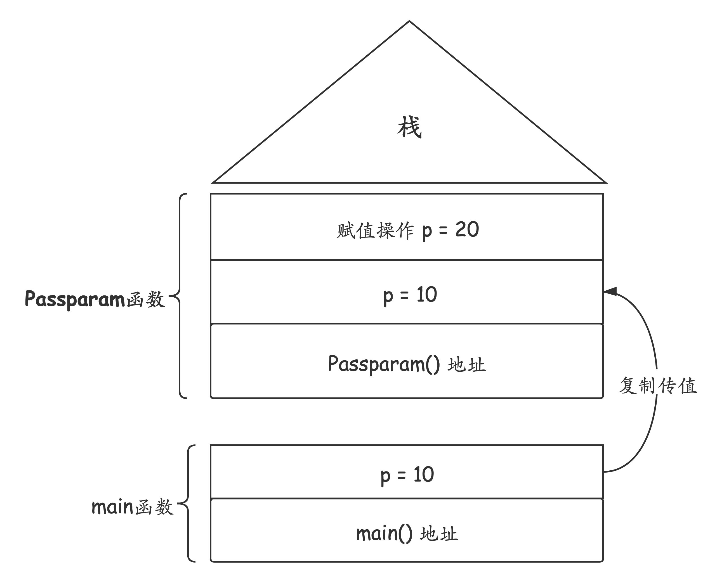
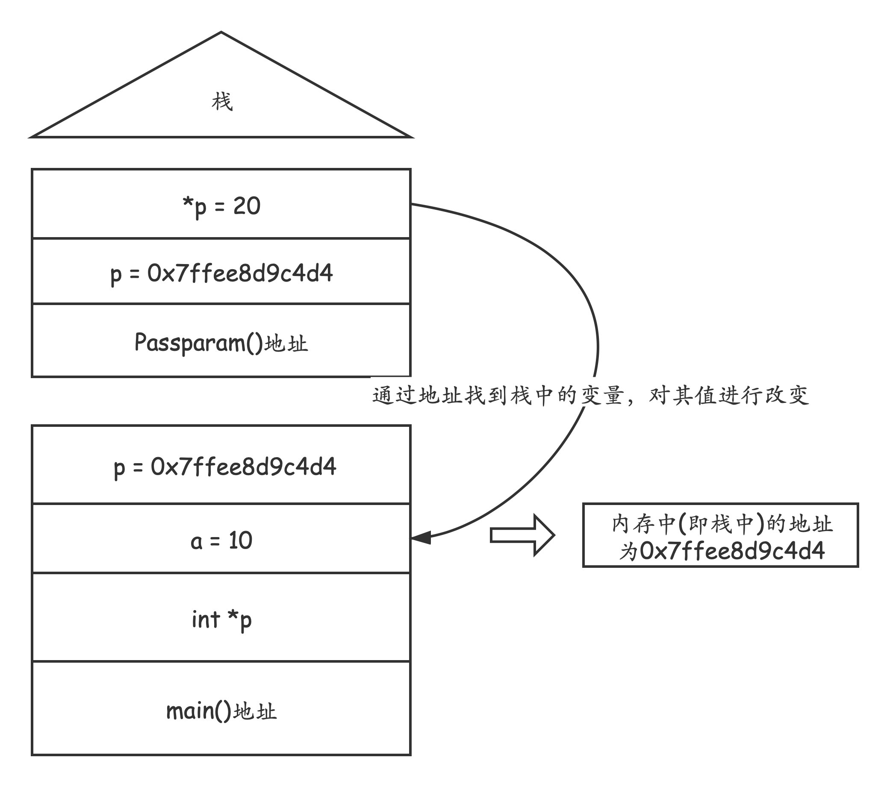
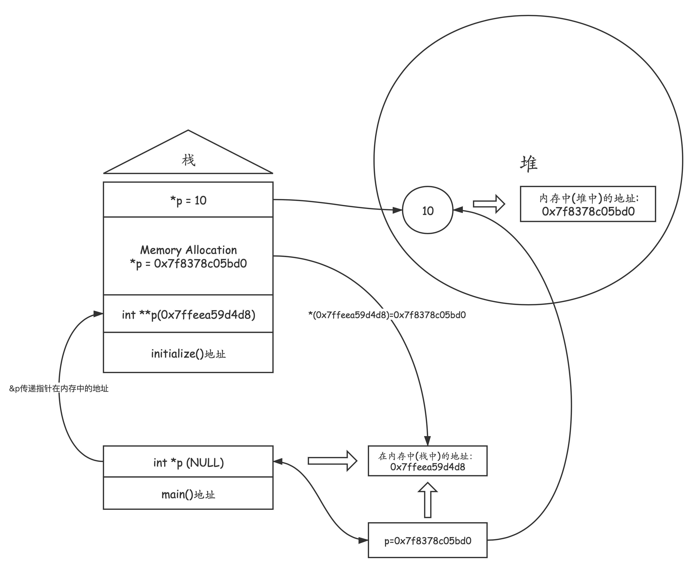

# 参数传递（一）

> ## C语言中的参数传递
>
> __值传递__
>
> > 通过在`main`函数中定义`int`类型的变量`p`，在`main`中赋值`10`，经过参数传递函数`Passparam`进行测试:
>
> ```c
> #include<stdio.h>
> #include<stdlib.h>
> void Passparam(int p)
> {
>     printf("in function, before assignment:%d\n",p);
>     p = 20;
>     printf("in function, after assignment:%d\n",p);
> }
> 
> 
> int main(void)
> {
>     int p;
>     p = 10;
>     printf("in main, before parameter passing:%d\n",p);
>     Passparam(p);
>     printf("in main, after parameter passing:%d\n",p);
> 
> }
> ```
>
> > 输出结果如下：
>
> ```
> in main, before parameter passing:10
> in function, before assignment:10
> in function, after assignment:20
> in main, after parameter passing:10
> ```
>
> > 测试实现了C语言函数间的复制传值，分析结构图如下：
>
> ​	
>
> > __分析：由于是函数局部变量的传递，所以发生在栈中，`main`中的局部变量`p`被复制传递至`Passparam`函数中的形式参数`p`，所以`Passparam`中的`p`的改变不会引起`main`中的`p`值的改变__
>
> __地址传递__
>
> > 地址传递，常见的例子即函数之间传递指针
>
> ```c
> #include<stdio.h>
> #include<stdlib.h>
> void Passparam(int *p)
> {
>     *p = 20;
> }
> int main(void)
> {
>     //声明一个int类型的指针p
>     //暂时不用malloc为其分配内存地址，在后面的代码中会为它分配一个局部变量的地址
>     int *p;
>     int a;
>     a = 10;
>     //将a的在内存中的地址传递给p
>     p = &a;
>     printf("value in p: %p\n",p);
>     printf("address of a: %p\n",&a);
>     printf("before parameter passing, value of a: %d\n",a);
>     Passparam(p);
>   	//等效于Passparam(&a)，即将a的地址传递给Passparam的形式参数p
>     printf("after parameter passing, value of a: %d\n",a);
> 
> }
> ```
>
> > 输出结果如下:
>
> ```
> value in p: 0x7ffee8d9c4d4
> address of a: 0x7ffee8d9c4d4
> before parameter passing, value of a: 10
> after parameter passing, value of a: 20
> ```
>
> > 运行与参数传递图如下:
>
> 
>
> 
>
> > 由此可见，C中的地址传递，其实也是一种值传递，只是这里的值是地址而已
>
> > 有时我们在main函数中，声明了指针，但是想通过封装初始化函数来为指针进行初始化，在初始化函数中用malloc为指针在堆中分配内存空间，可能会发现如下错误：
>
> ```c
> #include<stdio.h>
> #include<stdlib.h>
> void initialize(int *p)
> {
>     p = (int *)malloc(sizeof(int));
>     *p = 10;
> }
> 
> int main(void)
> {
>     int *p;
>     initialize(p);
>     printf("value in the address in p: %d\n",*p);
> }
> ```
>
> > 输出结果：
>
> ```
> in initialize, address of p: 0x7fd535405bd0
> value in the address in p: -125990072
> ```
>
> > 发现指针`p`指向的值并未变为`10`，原因如下:
> >
> > 虽然`initialize`中的`p`分配到了堆中的地址，`main`中的指针`p`并未分配到内存中的地址，所以其指向的值并未发生改变。
>
> 
>
> > 那么为了避免这种情况，可以参考以下两种方法:
>
> > 第一种，使用二维指针为一维指针分配地址，我们常听说只有指向变量的指针才能操作变量的地址，那么也只有指向指针的指针才能操作指针的地址：
>
> ```c
> #include<stdio.h>
> #include<stdlib.h>
> void initialize(int **p)
> {
>     *p = (int *)malloc(sizeof(int));
>     printf("in initialize, value of p: %p\n",p);
>     printf("in initialize, value in the address in p: %p\n",*p);
>     **p = 10;
>     printf("in initialize, value in the address in the *p: %d\n",**p);
> }
> 
> int main(void)
> {
>     int *p;
>     printf("in main, address of p: %p\n",&p);
>     initialize(&p);
>     printf("in main, value of p: %p\n",p);
>     printf("in main, value in the address in p: %d\n",*p);
> }
> ```
>
> > 输出结果：
>
> ```
> in main, address of p: 0x7ffeea59d4d8
> in initialize, value of p: 0x7ffeea59d4d8
> in initialize, value in the address in p: 0x7f8378c05bd0
> in initialize, value in the address in the *p: 10
> in main, value of p: 0x7f8378c05bd0
> in main, value in the address in p: 10
> ```
>
> > 程序分析图:
>
> 
>
> > 第二种，使用返回值传回地址：
>
> ```c
> #include<stdio.h>
> #include<stdlib.h>
> int* initialize()
> {
>     int* p;
>     p = (int *)malloc(sizeof(int));
>     *p = 10;
>     printf("in initialize, value of p: %p\n",p);
>     printf("in initialize, value in the address in p: %d\n",*p);
>     return p;
> }
> 
> int main(void)
> {
>     int *p;
>     p=initialize();
>     printf("in main, value of p: %p\n",p);
>     printf("in main, value in the address in p: %d\n",*p);
> }
> ```
>
> > 输出结果：
>
> ```
> in initialize, value of p: 0x7ff23f405bd0
> in initialize, value in the address in p: 10
> in main, value of p: 0x7ff23f405bd0
> in main, value in the address in p: 10
> ```
>
> > 分析：通过在`initialize`函数中直接声明`int *p`并分配内存空间，同时赋值，最后回传地址给`main`中的指针`p`，实现初始化。
>
> > __C语言中在函数参数声明区域，不能通过&直接获取实际参数，对实参进行直接操作。__
>
> 

