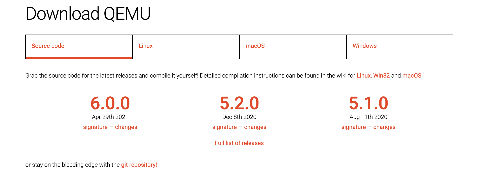
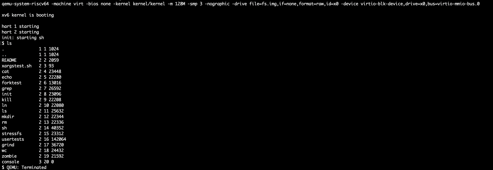

# 操作系统——MIT6.S081实验环境配置（macOS Big Sur 11.3）

_参考资料：[6.S081 / Fall 2020 (mit.edu)](https://pdos.csail.mit.edu/6.828/2020/tools.html)_

_[Lab: Xv6 and Unix utilities (mit.edu)](https://pdos.csail.mit.edu/6.828/2020/labs/util.html)_

##  实验系统及前提：

> 1. macOS系统
>
> 2. 已安装Homebrew
>
> 3. 已下载实验源代码：
>
>    由于原地址`git clone git://g.csail.mit.edu/xv6-labs-2020`存在无法下载的问题，故克隆非官方仓库`git clone https://github.com/cccriscv/xv6-labs-2020.git`下载源代码

## 实验环境的搭建

### 预备处理

这里建议先更新Homebrew之后再进行之后的安装过程：

> ```shell
> $ brew update
> $ brew upgrade
> ```

### 1. 安装编译工具链[RISC-V compiler toolchain]

这里使用实验的官方文档给出的配置方法，输入以下命令进行安装即可：

> ```shell
> $ brew tap riscv/riscv
> $ brew install riscv-tools
> ```

安装之后将编译工具链添加进用户环境变量中

> ```shell
> # 打开用户环境变量配置文件
> nano ~/.bash_profile
> # 向文件中添加如下语句
> PATH=$PATH:/usr/local/opt/riscv-gnu-toolchain/bin
> # 重启配置文件
> source ~/.bash_profile
> ```

### 2. 安装模拟处理器[qemu]

这里不建议使用官方文档给出的Homebrew方法直接安装，这样可能会在运行xv6系统时，出现如下由于版本过高导致的问题：

> ```shell
> qemu-system-riscv64 -machine virt -bios none -kernel kernel/kernel -m 128M -smp 3 -nographic -drive file=fs.img,if=none,format=raw,id=x0 -device virtio-blk-device,drive=x0,bus=virtio-mmio-bus.0
> ```

推荐使用编译安装的方法:

1. 打开qemu官网下载：[Download QEMU - QEMU](https://www.qemu.org/download/)，这里我们选择5.1.0版本



2. 下载并解压后，进入到目标文件夹qemu-5.1.0后，按照如下顺序进行安装：

   > ```shell
   > # 这里默认安装到 /usr/local 中
   > ./configure
   > ```

   这里我们只安装`riscv64-softmmu`，打开文件夹下的`config-host.mak`，注释掉原先的`TARGET_DIRS`相关内容，修改为：

   > ```shell
   > TARGET_DIRS=riscv64-softmmu
   > ```

   此时进行最后的安装过程：

   > ```shell
   > # 编译源文件
   > make
   > # 安装模拟处理器
   > make install
   > ```

### 3. 测试样例程序

切换到`xv6-labs-2020`目录，输入命令`make qemu`，进入系统，之后测试命令`ls`，之后，按下`CTRL + a `后再按下`x`退出系统：



