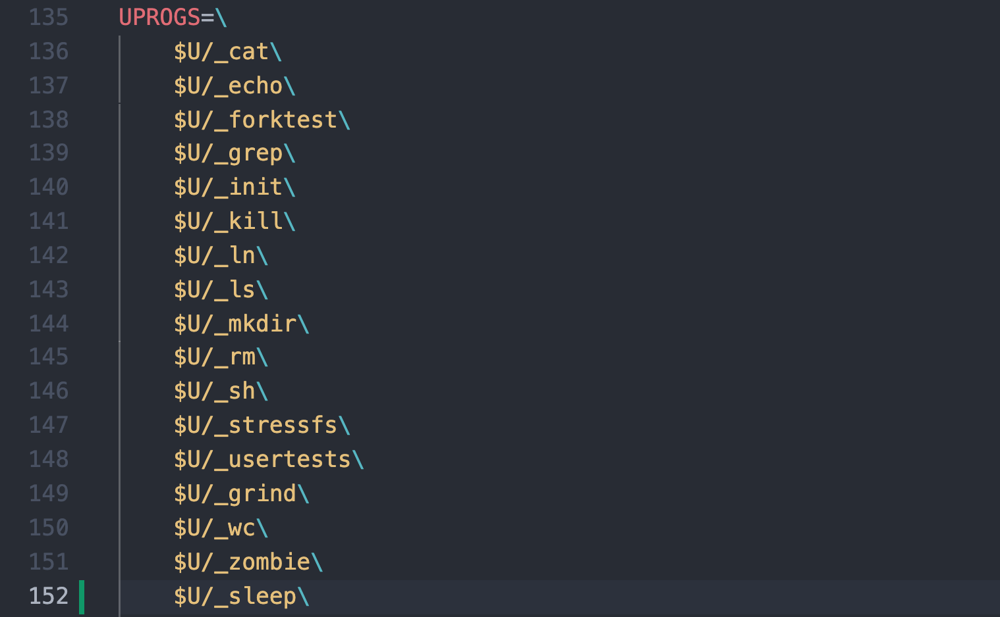
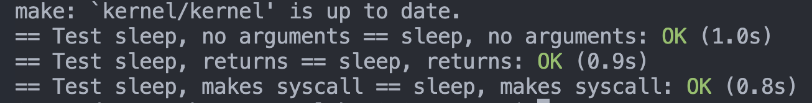
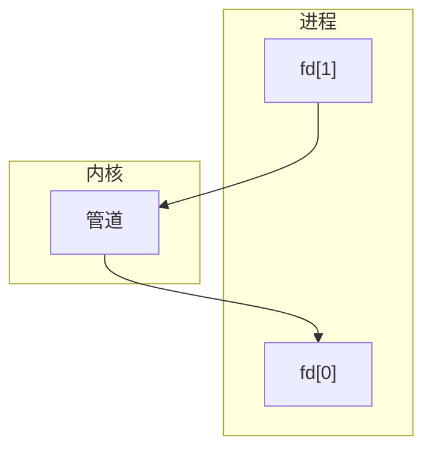
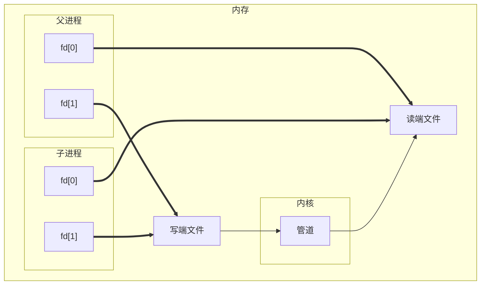
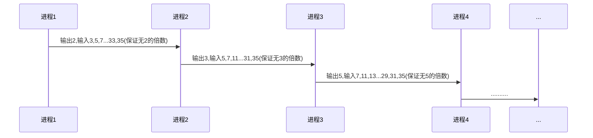
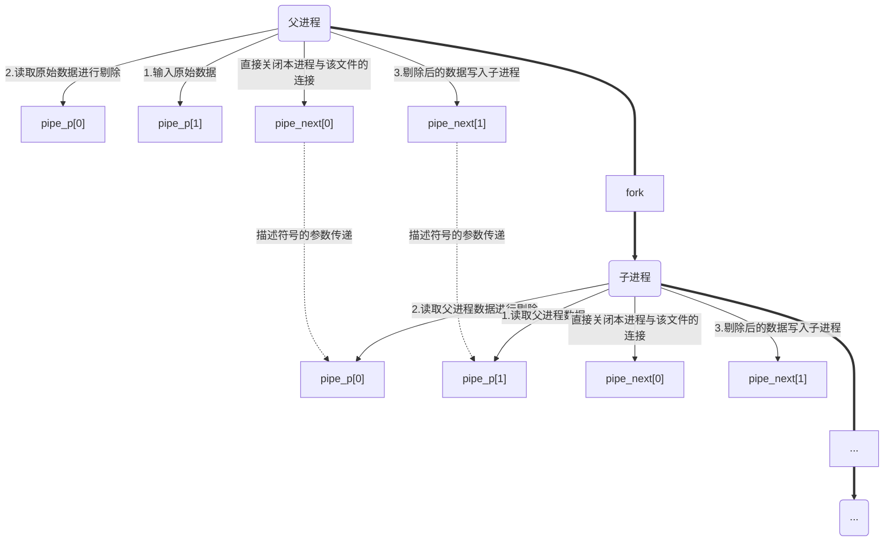

# 操作系统——MIT6.S081实验一

## 实验源代码目录介绍

1. 内核程序目录

   > /xv6-labs-2020/kernel

2. 用户程序目录

   > /xv6-labs-2020/user

3. 在/user目录中编写C语言程序，使用`make clean`编译后，启动系统测试程序。

## 一. sleep实验

编写用户程序sleep.c，用于将进程暂停特定的时间。

C程序如下

```C
#include "../kernel/types.h"
#include "../user/user.h"

int main(int argc, char *argv[]){
  // 如果不输入其他参数，这里的命令行参数默认为1，即argv[0]，代表程序的运行的绝对路径
  // 所以有效的argc必须为2，argv[1]代表用户输入的暂停时间
	if(argc != 2){
		fprintf(2, "must 1 argument for sleep\n");
		exit(1);
	}
  // 这里字符串到整型的类型转换使用了ulib.c中的atoi函数
	int sleeptime = atoi(argv[1]);
	printf("(nothing happens for a little while)\n");
	sleep(sleeptime);
	exit(0);
}

```

将sleep.c路径添加到Makefile的`UPROGS`中



在通过`make clean`编译后，使用`./grade-lab-util sleep`通过测试：




## 二. pingpong实验

这里ping-pong实验是通过管道的方式来实现父子进程之间的通信。

参考_《UNIX环境高级编程》第三版_ 中15.2节关于管道的原理的讲解，管道主要采用半双工的方式实现进程间的通信，且管道只能在具有公共祖先的两个进程间使用。

实现原理如下：

1. 创建管道，并使进程与管道相连接：

   进程与管道的连接存在从进程到管道的写端`fd[1]`，和从管道到进程的读端`fd[0]`。



2. 父进程创建子进程，子进程与管道相连接：

   ```mermaid
   graph TB
   subgraph A[父进程]
   A0["fd[0]"]
   A1["fd[1]"]
   end
   subgraph B[子进程]
   B0["fd[0]"]
   B1["fd[1]"]
   end
   subgraph C[内核]
   C0["管道"]
   end
   
   A1 --> C0
   B1 --> C0
   C0 --> A0
   C0 --> B0
   ```

   

3. 通过关闭父子进程与管道连接的读端和写端，来控制数据流的方向：

   如，关闭子进程的写端`fd[1]`和父进程的读端`fd[0]`，见下图虚线部分，实现从父进程到子进程之间的数据传输。

   ```mermaid
   graph TB
   subgraph A[父进程]
   A0["fd[0]"]
   A1["fd[1]"]
   end
   subgraph B[子进程]
   B0["fd[0]"]
   B1["fd[1]"]
   end
   subgraph C[内核]
   C0["管道"]
   end
   
   A1 --> C0
   B1 -.-> C0
   C0 -.-> A0
   C0 --> B0
   ```

__注意事项__：父进程使用`fork`复制出子进程时，父进程的管道文件描述符也会被复制到子进程中，但是文件描述符不等于文件本身，即当父进程关闭了某对管道描述符对应的读写端，子进程仍可以通过复制得到的管道描述符，对管道进行读写操作。

__既然如此，这里可以猜想管道到底发挥了什么样的作用？__

当父进程与管道建立连接后，`fd[0]`和`fd[1]`分别代表读端和写端，当父进程通过`fd[1]`向文件中写入数据后，这时管道就开始发挥作用了，将`fd[1]`对应的文件中的内容复制到`fd[0]`对应的文件中去，父进程创建的子进程便可以通过`fd[0]`读取数据。



实验代码：

```c
#include "../user/user.h"

int main(void)
{
    char recvbuf[0];
    char sendbuf[]={'B'};
    // 父进程与管道相连接
    int pipe_p[2];
    // 子进程与管道相连接
    int pipe_c[2];
		
    pipe(pipe_p);
    pipe(pipe_c);

    // 子进程处理
    // 子进程 --> 父进程
    if(fork() == 0){
        // 关闭属于父进程的写端和子进程的读端
        close(pipe_p[1]);
        close(pipe_c[0]);
        
        // 子进程从管道中读取数据
        if(read(pipe_p[0], recvbuf, sizeof(recvbuf)) != 0)
        {
            printf("%d: received ping\n",getpid());
            // 子进程向管道写入数据
            write(pipe_c[1], sendbuf, sizeof(sendbuf));
        }
        // 关闭子进程的写端和属于父进程的读端
        close(pipe_p[0]);
        close(pipe_c[1]);
        exit(0);
    }
    // 父进程处理
    // 父进程 --> 子进程
    else{
        // 关闭属于子进程的写端和父进程的读端
        close(pipe_c[1]);
        close(pipe_p[0]);

        // 父进程向管道中写入数据
        write(pipe_p[1], sendbuf, sizeof(sendbuf));
      
        // 父进程从管道读取数据
        if(read(pipe_c[0], recvbuf, sizeof(recvbuf)) != 0)
        {
            printf("%d: received pong\n",getpid());
        }
        // 关闭父进程的写端和属于子进程的读端
        close(pipe_c[0]);
        close(pipe_p[1]);
        wait(0);
        exit(0);
    }
}
```

添加路径到Makefile中后，执行`make clean`和`./grade-lab-util pingpong`后，实验结果如下：


那么对于本题来说，我们能否只使用一对管道描述符来操作呢？

事实上是可以的，父进程首先使用管道写入数据，之后父进程休眠，子进程使用管道读取数据，再通过管道写入数据，最后父进程读取出数据后结束。这里的管道连接由于是不同进程的同一描述符（或者说对应的同一文件），故不需要关闭对应的管道描述符。

实验代码：

```c
#include "../user/user.h"

int main(void)
{
    char recvbuf[0];
    char sendbuf[]={'B'};
    // 进程与管道相连接
    int p[2];
  	
    pipe(p);
  	
    if(fork() == 0){
        // 子进程从管道中读取数据
        if(read(p[0], recvbuf, sizeof(char)) != 0)
        {
            printf("%d: received ping\n",getpid());
            // 子进程向管道写入数据
            write(p[1], sendbuf, sizeof(char));
        }
        exit(0);
    }
    else 
    {
        // 父进程向管道中写入数据
        write(p[1], sendbuf, sizeof(char));
      	//这里一定要加上sleep，进程休眠，否则父进程一旦读取完数据，子进程便无数据可读了
        sleep(1);
        // 父进程从管道读取数据
        if(read(p[0], recvbuf, sizeof(char)) != 0)
        {
            printf("%d: received pong\n",getpid());
        }
        wait(0);
        exit(0);
    }
}
```

实验结果：


## 三. primes实验

实验内容：第一个进程将数字2到35输入到管道中。对于每个素数，您将安排创建一个进程，该进程通过一个管道从其左邻居读取数据，并通过另一个管道向其右邻居写入数据。由于xv6的文件描述符和进程数量有限，因此第一个进程可以在35处停止。

如下图给出了一个算法，由主进程输入2～35后，每次子进程输出首位数字，并剔除其他数中所有为首位数字的倍数，并将剩余数输入到下一子进程中，依次得到所有素数：



程序设计流程图：



实验代码：

```c
#include "../user/user.h"

void primes(int pipe_p[])
{
    // 首位素数数据
    int flag = 0;
    // 数据缓存
    int buffer = 0;
    // 建立新的父进程与管道的连接
    int pipe_next[2];
    pipe(pipe_next);
    // 子进程处理
    if(fork() == 0)
    {
        // 进程休眠等待父进程停止
        sleep(1);
        // 关闭子进程复制父进程原连接的读写端
        close(pipe_p[0]);
        close(pipe_p[1]);
        // 子进程作为父进程进入递归
        primes(pipe_next);
    }
    // 父进程处理
    else
    {
        // 关闭父进程的新连接的读端
        close(pipe_next[0]);
        // 关闭父进程的原连接的写端
        close(pipe_p[1]);
        // 读取首位素数数据
        if(read(pipe_p[0], &flag, sizeof(int)) != 0)
        {
            printf("prime %d\n",flag);
            // 读取其他元素
            while(read(pipe_p[0], &buffer, sizeof(int)) != 0)
            {
                // 向父进程的新连接写入
                if(buffer % flag != 0)
                {
                    write(pipe_next[1], &buffer, sizeof(int));
                }
            }
            // 关闭父进程的原连接的读端
            close(pipe_p[0]);
            // 关闭父进程的新连接的写端
            close(pipe_next[1]);
            // 等待子进程结束
            wait(0);
            exit(0);
        }
    }
    exit(0);
}

int main(void)
{
    int pipe_p[2];
    // 父进程连接管道
    pipe(pipe_p);

    // 父进程写入数据
    for(int i = 2; i <= 35; i++)
    {
        write(pipe_p[1], &i, sizeof(int));
    }
    primes(pipe_p);
    exit(0);
}
```

实验结果：


## 四. find实验

输入查找目录和目标文件名，输出所有符合条件的文件的完整路径。

相关函数和结构体说明：

```C
// 文件状态结构体
struct stat {
  int dev;     // File system's disk device
  uint ino;    // Inode number
  short type;  // Type of file
  short nlink; // Number of links to file
  uint64 size; // Size of file in bytes
};

// 文件状态获取函数
int fstat(int fd, struct stat*);

// 文件结构体
struct dirent {
  ushort inum;
  char name[DIRSIZ];
};
```

实验代码：

```C
#include "../kernel/types.h"
#include "../kernel/stat.h"
#include "../user/user.h"
#include "../kernel/fs.h"

int exist(char* path, char* file) 
{
    int i, j;
    for(i = strlen(file) - 1, j = strlen(path) - 1; i >= 0; i--, j--)
    {
        if(file[i] != path[j])
        {
            return -1;
        }
    }
    if(path[j] == '/')
    {
        return 0;
    }
    return -1;
}

void find(char* path, char* file) 
{
    int fd;
    char buf[512];
    struct stat st;
    struct dirent de;
    char* p;
    if ((fd = open(path, 0)) < 0) {
        fprintf(2, "find: cannot open %s\n", path);
        return;
    }
    if (fstat(fd, &st) < 0) {
        fprintf(2, "find: cannot stat %s\n", path);
        close(fd);
        return;
    }
    switch (st.type) {
    case T_FILE:
        // 判断是否是目标文件
        if (exist(path, file) == 0) {
            printf("%s\n", path);
        }
        break;
    case T_DIR:
        if (strlen(path) + 1 + DIRSIZ + 1 > sizeof buf) {
            printf("find: path too long\n");
            break;
        }
        strcpy(buf, path);
        p = buf + strlen(buf);
        *p++ = '/';
        while(read(fd, &de, sizeof de) == sizeof de) {
            if (de.inum == 0) continue;
            if (strcmp(de.name, ".") == 0 || strcmp(de.name, "..") == 0) {
                continue;
            }
            memmove(p, de.name, DIRSIZ);
            p[DIRSIZ] = 0;
          	// 属于目录，递归查找
            find(buf, file);
        }
        break;
    default:
        break;
    }
    close(fd);
}

int
main(int argc, char* argv[])
{
    if (argc < 3) {
        printf("need path and target name\n");
        exit(1);
    }
    find(argv[1], argv[2]);
    exit(0);
}

```

实验结果：


## 五. xargs实验

实验内容：shell中的 `|`会将标准输出转换为标准输入，设计`xargs`指令，将标准输入转化为`xargs`后的指令的命令行参数。例如：

```shell
# 命令行输入：
echo hello > b
find . b | xargs grep hello

# 预期输出：
hello

# 解析：
# 首先在当前目录创建文件b，并输入hello至文件b中
# 执行find . b命令后，会输出./b到标准输出文件中
# “|”会将./b从标准输出中转换到标准输入文件中
# 执行xargs命令时，会将grep hello命令后添加./b再执行，即执行的完整命令：grep hello ./b
# 故输出：hello
```

exec函数说明：

```c
// 参数path为可执行文件的名称或路径
// argv为参数数组，且最后一个参数必须为0
int exec(char *path, char **argv)	
```

实验代码：

```c
#include "../kernel/types.h"
#include "../kernel/param.h"
#include "../user/user.h"

int main(int argv, char * args[])
{
    const int max_arg_len = 16;
    char *params[MAXARG];
    int index_of_params = 0;
    char buffer[1024];
    char *arg;
    int index_of_arg = 0;
    char *cmd;
    cmd = args[1];
    arg = (char *)malloc(sizeof(char) * max_arg_len);
    for(int i=1;i<argv;i++)
    {
        params[index_of_params++] = args[i];
    }
    // 通过 "|" 左边的命令执行后的输出会存储在标准输入文件中
    // 从标准输入中读取结果数据
    if(read(0, buffer, sizeof(buffer)) > 0)
    {
        for(int i = 0; i < strlen(buffer); i++)
        {
            // 读取到空格或是换行符即开始存储新的参数
            if(buffer[i] == ' ' || buffer[i] == '\n')
            {
                arg[index_of_arg] = 0;
                // 记录当前arg在内存中的地址
                params[index_of_params++] = arg;
                // 需要给arg分配新的内存地址
                arg = (char *)malloc(sizeof(char) * max_arg_len);
                index_of_arg = 0;
            }
            else
            {
                arg[index_of_arg++] = buffer[i];
            }
        }
        // 最后的参数必须为0
        params[index_of_params] = 0;
        exec(cmd, params);

        // 释放内存空间
        for(int i = 0; i < index_of_params; i++)
        {
            free(params[index_of_params]);
        }
    }
    return 0;
}
```

实验结果：


