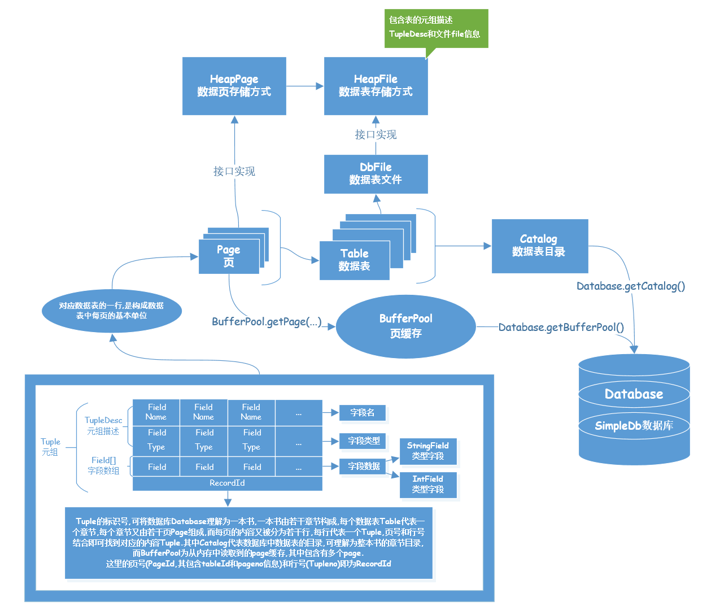
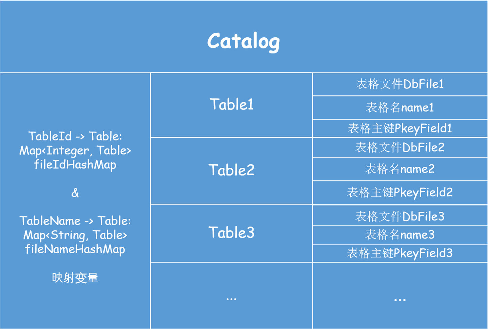
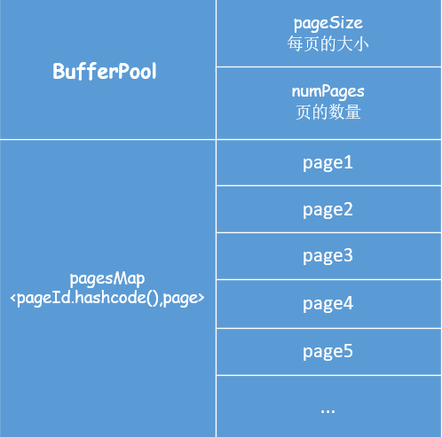
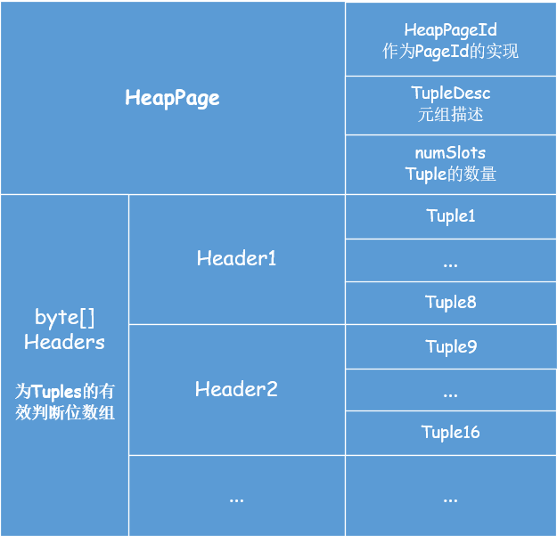

# Mit6.830---SimpleDB Lab1笔记

## 一. Lab1整体实现框架梳理

### 	1. Tuple 和 TupleDesc的关系及作用

> `Tuple`在这里是元组的意思,作为数据表的一行,包含`TupleDesc`和字段数据数组.
>
> `TupleDesc`是元组描述,包含字段类型数组和字段名称数组.



### 2. Catalog 的作用

> 数据库`Database`是由多张数据表构成的,这时要区分各个数据表而设计了`Catalog`作为数据表的总目录.
>
> 这里我们还要设计内部类`Table`作为`Catalog`中的存储单位,包含`DbFile`和表格名称以及表格主键作为成员变量.
>
> 那么,`Catalog`中如何设计`Table`的存储方式呢?
>
> 这里我们可以使用映射的方式来存储,键值可以设计为`int TableId`,值则设计为`Table`.
>
> 那么这里的`TableId`如何获取呢?
>
> 我们可以查看接口文件`src\java\simpledb\storage\DbFile.java`,其中就有相关方法`DbFile.getId()`,这要等我们实现了`HeapFile`类中的该方法,就可以体会其中的作用了.



### 3. BufferPool 的作用

> 一张数据表Table是由多个Page组成的,而数据表是由文件的形式存在于硬盘中,因此想要获取到表格信息,则必须从硬盘中读取数据表信息到内存中,而这个读取单位则是Page,`BufferPool`正是为了缓存Page而存在的.
>
> Lab1中要实现`BufferPool.getPage(...)`这一成员方法,而这一操作的实现要涉及到文件的读取操作,以`pageSize`为实际读取单位,并将读取到的`Page`添加到映射变量中.



### 4. 关于HeapFile, HeapPage 和 HeapPageId, 以及RecordId的说明

> 数据表在硬盘中以文件`DbFile`类的形式存储,`HeapFile`是其中的一种文件存储形式,也是`DbFile`接口的一种实现.
>
> `HeapPage`是构成`HeapFile`的单位,既然`HeapFile`作为数据表在硬盘中的一种存储形式,多个`HeapPage`则作为数据表在内存中的存储形式.该类包含有`HeapPageId`,`header`(用于判断对应内存槽中包含的元组内容是否有效),和`Tuple[]`元组数组,以及`TupleDesc`元组描述等成员变量.
>
> `HeapPageId`是`HeapPage`的标识符,也是`PageId`接口的实现类,包含该页所属表格的表格号`int TableId`和所处表格中的页号`int pgNo`.




## 二. Lab1实验过程

### Exercise 1.

***

**Implement the skeleton methods in:**

* __src/java/simpledb/storage/TupleDesc.java__

* __src/java/simpledb/storage/Tuple.java__

***

参考上述图示结构,实验代码如下:

`src/java/simpledb/storage/TupleDesc.java`

```java
package simpledb.storage;

import simpledb.common.Type;

import java.io.Serializable;
import java.util.*;

/**
 * TupleDesc describes the schema of a tuple.
 * 
 */
public class TupleDesc implements Serializable {

    /**
     * A help class to facilitate organizing the information of each field
     * 
     * */
    public static class TDItem implements Serializable {

        private static final long serialVersionUID = 1L;

        /**
         * The type of the field
         * */
        public final Type fieldType;

        /**
         * The name of the field
         * */
        public final String fieldName;

        public TDItem(Type t, String n) {
            this.fieldName = n;
            this.fieldType = t;
        }

        public String toString() {
            return fieldName + "(" + fieldType + ")";
        }
    }
    private TDItem [] tdItems;

    /**
     * @return
     *        An iterator which iterates over all the field TDItems
     *        that are included in this TupleDesc
     *        
     * */
    public Iterator<TDItem> iterator() {
        // some code goes here
        return (Iterator<TDItem>) Arrays.asList(tdItems).iterator();
    }

    private static final long serialVersionUID = 1L;

    /**
     * Create a new TupleDesc with typeAr.length fields with fields of the
     * specified types, with associated named fields.
     * 
     * @param typeAr
     *            array specifying the number of and types of fields in this
     *            TupleDesc. It must contain at least one entry.
     *            
     * @param fieldAr
     *            array specifying the names of the fields. Note that names may
     *            be null.
     *            
     */
    public TupleDesc(Type[] typeAr, String[] fieldAr) {
        // some code goes here
        this.tdItems = new TDItem[typeAr.length];
        for(int i = 0; i < typeAr.length; i++)
        {
            this.tdItems[i] = new TDItem(typeAr[i], fieldAr[i]);
        }
    }

    /**
     * Constructor. Create a new tuple desc with typeAr.length fields with
     * fields of the specified types, with anonymous (unnamed) fields.
     * 
     * @param typeAr
     *            array specifying the number of and types of fields in this
     *            TupleDesc. It must contain at least one entry.
     */
    public TupleDesc(Type[] typeAr) {
        // some code goes here
        this.tdItems = new TDItem[typeAr.length];
        for(int i = 0; i < typeAr.length; i++)
        {
            this.tdItems[i] = new TDItem(typeAr[i], null);
        }
    }

    /**
     * @return the number of fields in this TupleDesc
     */
    public int numFields() {
        // some code goes here
        return this.tdItems.length;
    }

    /**
     * Gets the (possibly null) field name of the ith field of this TupleDesc.
     * 
     * @param i
     *            index of the field name to return. It must be a valid index.
     * @return the name of the ith field
     * @throws NoSuchElementException
     *             if i is not a valid field reference.
     */
    public String getFieldName(int i) throws NoSuchElementException {
        // some code goes here
        if(i >= 0 && i < this.numFields())
        {
            return this.tdItems[i].fieldName;
        }
        else
        {
            throw new NoSuchElementException();
        }
    }

    /**
     * Gets the type of the ith field of this TupleDesc.
     * 
     * @param i
     *            The index of the field to get the type of. It must be a valid
     *            index.
     * @return the type of the ith field
     * @throws NoSuchElementException
     *             if i is not a valid field reference.
     */
    public Type getFieldType(int i) throws NoSuchElementException {
        // some code goes here
        if(i >= 0 && i < this.numFields())
        {
            return this.tdItems[i].fieldType;
        }
        else
        {
            throw new NoSuchElementException();
        }
    }

    /**
     * Find the index of the field with a given name.
     * 
     * @param name
     *            name of the field.
     * @return the index of the field that is first to have the given name.
     * @throws NoSuchElementException
     *             if no field with a matching name is found.
     */
    public int fieldNameToIndex(String name) throws NoSuchElementException {
        // some code goes here
        
        for(int i = 0; i < this.numFields(); i++)
        {
            if(this.tdItems[i].fieldName != null && name !=null && this.tdItems[i].fieldName.equals(name))
            {
                return i;
            }
            else if(this.tdItems[i].fieldName == null && name ==null)
            {
                return i;
            }
        }
        throw new NoSuchElementException();
    }

    /**
     * @return The size (in bytes) of tuples corresponding to this TupleDesc.
     *         Note that tuples from a given TupleDesc are of a fixed size.
     * 
     */
    public int getSize() {
        // some code goes here
        int size = 0;
        for(TDItem item : this.tdItems)
        {
            size = size + item.fieldType.getLen();
        }
        return size;
    }

    /**
     * Merge two TupleDescs into one, with td1.numFields + td2.numFields fields,
     * with the first td1.numFields coming from td1 and the remaining from td2.
     * 
     * @param td1
     *            The TupleDesc with the first fields of the new TupleDesc
     * @param td2
     *            The TupleDesc with the last fields of the TupleDesc
     * @return the new TupleDesc
     */
    public static TupleDesc merge(TupleDesc td1, TupleDesc td2) {
        // some code goes here
        Type[] types = new Type[td1.numFields() + td2.numFields()];
        String[] names = new String[td1.numFields() + td2.numFields()];
        for(int i = 0; i < td1.numFields(); i++)
        {
            types[i] = td1.getFieldType(i);
            names[i] = td1.getFieldName(i);
        }
        for(int i = td1.numFields(); i < td1.numFields() + td2.numFields(); i++)
        {
            types[i] = td2.getFieldType(i - td1.numFields());
            names[i] = td2.getFieldName(i - td1.numFields());
        }
        TupleDesc td = new TupleDesc(types, names);
        return td;
    }

    /**
     * Compares the specified object with this TupleDesc for equality. Two
     * TupleDescs are considered equal if they have the same number of items
     * and if the i-th type in this TupleDesc is equal to the i-th type in o
     * for every i.
     * 
     * @param o
     *         the Object to be compared for equality with this TupleDesc.
     *             
     * @return true if the object is equal to this TupleDesc.
     */

    public boolean equals(Object o) {
        // some code goes here
        if(!this.getClass().isInstance(o))
        {
            return false;
        }
        TupleDesc temp = (TupleDesc) o;
        if(temp.numFields() != this.numFields())
        {
            return false;
        }
        for(int i = 0; i < this.numFields(); i++)
        {
            if(!this.tdItems[i].fieldType.equals(temp.tdItems[i].fieldType))
            {
                return false;
            }
        }
        return true;
    }

    public int hashCode() {
        // If you want to use TupleDesc as keys for HashMap, implement this so
        // that equal objects have equals hashCode() results
        throw new UnsupportedOperationException("unimplemented");
    }

    /**
     * Returns a String describing this descriptor. It should be of the form
     * "fieldType[0](fieldName[0]), ..., fieldType[M](fieldName[M])", although
     * the exact format does not matter.
     * 
     * @return String describing this descriptor.
     */
    public String toString() {
        // some code goes here
        StringBuffer res = new StringBuffer();
        for(int i = 0; i < this.numFields() - 1; i++)
        {
            res.append(this.tdItems[i].fieldType.toString()+"("+this.tdItems[i].fieldName+"),");
        }
        res.append(this.tdItems[this.numFields() - 1].fieldType.toString()+"("+this.tdItems[this.numFields() - 1].fieldName+")");
        return res.toString();
    }
}

```

`ant runtest -Dtest=TupleDescTest `

```shell
runtest:
    [junit] Running simpledb.TupleDescTest
    [junit] Testsuite: simpledb.TupleDescTest
    [junit] Tests run: 6, Failures: 0, Errors: 0, Skipped: 0, Time elapsed: 0.037 sec
    [junit] Tests run: 6, Failures: 0, Errors: 0, Skipped: 0, Time elapsed: 0.037 sec
    [junit]
    [junit] Testcase: getSize took 0.013 sec
    [junit] Testcase: getType took 0.001 sec
    [junit] Testcase: numFields took 0 sec
    [junit] Testcase: combine took 0 sec
    [junit] Testcase: testEquals took 0.001 sec
    [junit] Testcase: nameToId took 0.009 sec

BUILD SUCCESSFUL
Total time: 2 seconds
```

`src/java/simpledb/storage/Tuple.java`

```java
package simpledb.storage;

import java.io.Serializable;
import java.util.Arrays;
import java.util.Iterator;

/**
 * Tuple maintains information about the contents of a tuple. Tuples have a
 * specified schema specified by a TupleDesc object and contain Field objects
 * with the data for each field.
 */
public class Tuple implements Serializable {

    private static final long serialVersionUID = 1L;
    private TupleDesc tupleDesc;
    private RecordId recordId;
    private Field[] fields;
    /**
     * Create a new tuple with the specified schema (type).
     *
     * @param td
     *            the schema of this tuple. It must be a valid TupleDesc
     *            instance with at least one field.
     */
    public Tuple(TupleDesc td) {
        // some code goes here
        this.tupleDesc = td;
        this.fields = new Field[td.numFields()];
    }

    /**
     * @return The TupleDesc representing the schema of this tuple.
     */
    public TupleDesc getTupleDesc() {
        // some code goes here
        return this.tupleDesc;
    }

    /**
     * @return The RecordId representing the location of this tuple on disk. May
     *         be null.
     */
    public RecordId getRecordId() {
        // some code goes here

        return this.recordId;
    }

    /**
     * Set the RecordId information for this tuple.
     *
     * @param rid
     *            the new RecordId for this tuple.
     */
    public void setRecordId(RecordId rid) {
        // some code goes here
        this.recordId = rid;
    }

    /**
     * Change the value of the ith field of this tuple.
     *
     * @param i
     *            index of the field to change. It must be a valid index.
     * @param f
     *            new value for the field.
     */
    public void setField(int i, Field f) {
        // some code goes here
        this.fields[i] = f;
    }

    /**
     * @return the value of the ith field, or null if it has not been set.
     *
     * @param i
     *            field index to return. Must be a valid index.
     */
    public Field getField(int i) {
        // some code goes here
        return fields[i];
    }

    /**
     * Returns the contents of this Tuple as a string. Note that to pass the
     * system tests, the format needs to be as follows:
     *
     * column1\tcolumn2\tcolumn3\t...\tcolumnN
     *
     * where \t is any whitespace (except a newline)
     */
    public String toString() {
        // some code goes here
        StringBuffer res = new StringBuffer();
        for(int i = 0; i < this.tupleDesc.numFields() - 1; i++)
        {
            res.append(this.fields[i].toString() + " ");
        }
        res.append(this.fields[this.tupleDesc.numFields() - 1].toString());
        return res.toString();
        // throw new UnsupportedOperationException("Implement this");
    }

    /**
     * @return
     *        An iterator which iterates over all the fields of this tuple
     * */
    public Iterator<Field> fields()
    {
        // some code goes here
        return Arrays.asList(this.fields).iterator();
    }

    /**
     * reset the TupleDesc of this tuple (only affecting the TupleDesc)
     * */
    public void resetTupleDesc(TupleDesc td)
    {
        // some code goes here
        this.tupleDesc = td;
    }
}

```

`ant runtest -Dtest=TupleTest`

这里的`TestCase:  modifyRecordId`报错是正常的.

> 原文: At this point, your code should pass the unit tests TupleTest and TupleDescTest. At this point, modifyRecordId() should fail because you havn't implemented it yet.

```shell
runtest:
    [junit] Running simpledb.TupleTest
    [junit] Testsuite: simpledb.TupleTest
    [junit] Tests run: 3, Failures: 0, Errors: 1, Skipped: 0, Time elapsed: 0.026 sec
    [junit] Tests run: 3, Failures: 0, Errors: 1, Skipped: 0, Time elapsed: 0.026 sec
    [junit] 
    [junit] Testcase: modifyFields took 0.01 sec
    [junit] Testcase: getTupleDesc took 0 sec
    [junit] Testcase: modifyRecordId took 0.002 sec
    [junit] 	Caused an ERROR
    [junit] modifyRecordId() test failed due to RecordId.equals() not being implemented.  This is not required for Lab 1, but should pass when you do implement the RecordId class.
    [junit] java.lang.UnsupportedOperationException: modifyRecordId() test failed due to RecordId.equals() not being implemented.  This is not required for Lab 1, but should pass when you do implement the RecordId class.
    [junit] 	at simpledb.TupleTest.modifyRecordId(TupleTest.java:54)
    [junit] 
 
BUILD FAILED
```


### Exercise 2.

***

**Implement the skeleton methods in:**

* __src/java/simpledb/common/Catalog.java__

***

`src/java/simpledb/common/Catalog.java`

```java
package simpledb.common;

import simpledb.common.Type;
import simpledb.storage.DbFile;
import simpledb.storage.HeapFile;
import simpledb.storage.TupleDesc;

import java.io.BufferedReader;
import java.io.File;
import java.io.FileReader;
import java.io.IOException;
import java.util.*;
import java.util.concurrent.ConcurrentHashMap;

/**
 * The Catalog keeps track of all available tables in the database and their
 * associated schemas.
 * For now, this is a stub catalog that must be populated with tables by a
 * user program before it can be used -- eventually, this should be converted
 * to a catalog that reads a catalog table from disk.
 * 
 * @Threadsafe
 */
public class Catalog {

    private class Table
    {
        DbFile dbFile;
        String name;
        String pkeyField;
        public Table(DbFile dbFile, String name, String pkeyField)
        {
            this.dbFile = dbFile;
            this.name = name;
            this.pkeyField = pkeyField;
        }
    }
    private ConcurrentHashMap<Integer, Table> fileIdHashMap;
    private ConcurrentHashMap<String, Table> fileNameHashMap;
    /**
     * Constructor.
     * Creates a new, empty catalog.
     */
    public Catalog() {
        // some code goes here
        fileIdHashMap = new ConcurrentHashMap<>();
        fileNameHashMap = new ConcurrentHashMap<>();
    }


    /**
     * Add a new table to the catalog.
     * This table's contents are stored in the specified DbFile.
     * @param file the contents of the table to add;  file.getId() is the identfier of
     *    this file/tupledesc param for the calls getTupleDesc and getFile
     * @param name the name of the table -- may be an empty string.  May not be null.  If a name
     * conflict exists, use the last table to be added as the table for a given name.
     * @param pkeyField the name of the primary key field
     */
    public void addTable(DbFile file, String name, String pkeyField) {
        // some code goes here
        fileIdHashMap.put(file.getId(), new Table(file, name, pkeyField));
        fileNameHashMap.put(name, new Table(file, name, pkeyField));
        
    }

    public void addTable(DbFile file, String name) {
        addTable(file, name, "");
    }

    // Mit 6.081 OS C
    // Mit 6.830 SimpleDB Java
    // Mit 6.824 Distribute System Golang

    /**
     * Add a new table to the catalog.
     * This table has tuples formatted using the specified TupleDesc and its
     * contents are stored in the specified DbFile.
     * @param file the contents of the table to add;  file.getId() is the identfier of
     *    this file/tupledesc param for the calls getTupleDesc and getFile
     */
    public void addTable(DbFile file) {
        addTable(file, (UUID.randomUUID()).toString());
    }

    /**
     * Return the id of the table with a specified name,
     * @throws NoSuchElementException if the table doesn't exist
     */
    public int getTableId(String name) throws NoSuchElementException {
        // some code goes here
        Table res;
        if((res = fileNameHashMap.get(name + "")) != null)
        {
            return res.dbFile.getId();
        }
        throw new NoSuchElementException();
    }

    /**
     * Returns the tuple descriptor (schema) of the specified table
     * @param tableid The id of the table, as specified by the DbFile.getId()
     *     function passed to addTable
     * @throws NoSuchElementException if the table doesn't exist
     */
    public TupleDesc getTupleDesc(int tableid) throws NoSuchElementException {
        // some code goes here
        Table res;
        if((res = fileIdHashMap.get(tableid)) != null)
        {
            return res.dbFile.getTupleDesc();
        }
        throw new NoSuchElementException();
    }

    /**
     * Returns the DbFile that can be used to read the contents of the
     * specified table.
     * @param tableid The id of the table, as specified by the DbFile.getId()
     *     function passed to addTable
     */
    public DbFile getDatabaseFile(int tableid) throws NoSuchElementException {
        // some code goes here
        Table res;
        
        if((res = fileIdHashMap.get(tableid)) != null)
        {
            return res.dbFile;
        }
        throw new NoSuchElementException();
    }

    public String getPrimaryKey(int tableid) {
        // some code goes here
        Table res;
        if((res = fileIdHashMap.get(tableid)) != null)
        {
            return res.pkeyField;
        }
        throw new NoSuchElementException();
    }

    public Iterator<Integer> tableIdIterator() {
        // some code goes here
        return fileIdHashMap.keySet().iterator();
    }

    public String getTableName(int id) {
        // some code goes here
        return fileIdHashMap.get(id).name;
    }
    
    /** Delete all tables from the catalog */
    public void clear() {
        // some code goes here
        fileIdHashMap.clear();
        fileNameHashMap.clear();
    }
    
    /**
     * Reads the schema from a file and creates the appropriate tables in the database.
     * @param catalogFile
     */
    public void loadSchema(String catalogFile) {
        String line = "";
        String baseFolder=new File(new File(catalogFile).getAbsolutePath()).getParent();
        try {
            BufferedReader br = new BufferedReader(new FileReader(catalogFile));
            
            while ((line = br.readLine()) != null) {
                //assume line is of the format name (field type, field type, ...)
                String name = line.substring(0, line.indexOf("(")).trim();
                //System.out.println("TABLE NAME: " + name);
                String fields = line.substring(line.indexOf("(") + 1, line.indexOf(")")).trim();
                String[] els = fields.split(",");
                ArrayList<String> names = new ArrayList<>();
                ArrayList<Type> types = new ArrayList<>();
                String primaryKey = "";
                for (String e : els) {
                    String[] els2 = e.trim().split(" ");
                    names.add(els2[0].trim());
                    if (els2[1].trim().equalsIgnoreCase("int"))
                        types.add(Type.INT_TYPE);
                    else if (els2[1].trim().equalsIgnoreCase("string"))
                        types.add(Type.STRING_TYPE);
                    else {
                        System.out.println("Unknown type " + els2[1]);
                        System.exit(0);
                    }
                    if (els2.length == 3) {
                        if (els2[2].trim().equals("pk"))
                            primaryKey = els2[0].trim();
                        else {
                            System.out.println("Unknown annotation " + els2[2]);
                            System.exit(0);
                        }
                    }
                }
                Type[] typeAr = types.toArray(new Type[0]);
                String[] namesAr = names.toArray(new String[0]);
                TupleDesc t = new TupleDesc(typeAr, namesAr);
                HeapFile tabHf = new HeapFile(new File(baseFolder+"/"+name + ".dat"), t);
                addTable(tabHf,name,primaryKey);
                System.out.println("Added table : " + name + " with schema " + t);
            }
        } catch (IOException e) {
            e.printStackTrace();
            System.exit(0);
        } catch (IndexOutOfBoundsException e) {
            System.out.println ("Invalid catalog entry : " + line);
            System.exit(0);
        }
    }
}


```

`ant runtest -Dtest=CatalogTest`

```shell
runtest:
    [junit] Running simpledb.CatalogTest
    [junit] Testsuite: simpledb.CatalogTest
    [junit] Tests run: 5, Failures: 0, Errors: 0, Skipped: 0, Time elapsed: 0.023 sec
    [junit] Tests run: 5, Failures: 0, Errors: 0, Skipped: 0, Time elapsed: 0.023 sec
    [junit]
    [junit] Testcase: getTupleDesc took 0.012 sec
    [junit] Testcase: getTableId took 0 sec
    [junit] Testcase: handleDuplicateIds took 0 sec
    [junit] Testcase: getDatabaseFile took 0 sec
    [junit] Testcase: handleDuplicateNames took 0.001 sec

BUILD SUCCESSFUL
Total time: 1 second
```


### Exercise 3.

***

**Implement the `getPage()` method in:**

* __src/java/simpledb/storage/BufferPool.java__

***

`src/java/simpledb/storage/BufferPool.java`

__注意__:

`Buffer Pool.getPage()`中`DbFile.readPage(PageId pid)`只能使用一次,也就是说最好定义一个`Page`变量暂存读取到的数据页信息,进行添加操作后再返回该变量.

如果这里不使用变量暂存,返回时又要使用一次`DbFile.readPage(PageId pid)`方法,虽然得到的值是相同的,但是在__Exercise6__时会出现数据页读取次数过多的Bug,本人就是找了很久才发现的这一问题,也说明函数使用要更加谨慎才好.

```java
package simpledb.storage;

import simpledb.common.Database;
import simpledb.common.Permissions;
import simpledb.common.DbException;
import simpledb.common.DeadlockException;
import simpledb.transaction.TransactionAbortedException;
import simpledb.transaction.TransactionId;

import java.io.*;

import java.util.concurrent.ConcurrentHashMap;

/**
 * BufferPool manages the reading and writing of pages into memory from
 * disk. Access methods call into it to retrieve pages, and it fetches
 * pages from the appropriate location.
 * <p>
 * The BufferPool is also responsible for locking;  when a transaction fetches
 * a page, BufferPool checks that the transaction has the appropriate
 * locks to read/write the page.
 * 
 * @Threadsafe, all fields are final
 */
public class BufferPool {
    /** Bytes per page, including header. */
    private static final int DEFAULT_PAGE_SIZE = 4096;

    private static int pageSize = DEFAULT_PAGE_SIZE;
    
    /** Default number of pages passed to the constructor. This is used by
    other classes. BufferPool should use the numPages argument to the
    constructor instead. */
    public static final int DEFAULT_PAGES = 50;
    private int numPages;
    // key ==> pageId  value ==> page
    private ConcurrentHashMap<Integer, Page> pagesMap;
    /**
     * Creates a BufferPool that caches up to numPages pages.
     *
     * @param numPages maximum number of pages in this buffer pool.
     */
    public BufferPool(int numPages) {
        // some code goes here
        this.numPages = numPages;
        pagesMap = new ConcurrentHashMap<>();
    }
    
    public static int getPageSize() {
      return pageSize;
    }
    
    // THIS FUNCTION SHOULD ONLY BE USED FOR TESTING!!
    public static void setPageSize(int pageSize) {
    	BufferPool.pageSize = pageSize;
    }
    
    // THIS FUNCTION SHOULD ONLY BE USED FOR TESTING!!
    public static void resetPageSize() {
    	BufferPool.pageSize = DEFAULT_PAGE_SIZE;
    }

    /**
     * Retrieve the specified page with the associated permissions.
     * Will acquire a lock and may block if that lock is held by another
     * transaction.
     * <p>
     * The retrieved page should be looked up in the buffer pool.  If it
     * is present, it should be returned.  If it is not present, it should
     * be added to the buffer pool and returned.  If there is insufficient
     * space in the buffer pool, a page should be evicted and the new page
     * should be added in its place.
     *
     * @param tid the ID of the transaction requesting the page
     * @param pid the ID of the requested page
     * @param perm the requested permissions on the page
     */
    public  Page getPage(TransactionId tid, PageId pid, Permissions perm)
        throws TransactionAbortedException, DbException {
        // some code goes here
        if(! pagesMap.containsKey(pid.hashCode()))
        {
            // evict page then add page
            if(pagesMap.size() >= this.numPages)
            {
                evictPage();
            }
            // add page
            /**
             * Catalog == through tableId of the one in related dbFile ==> DatabaseFile
             * DatabaseFile == through pageId of the one in related dbFile ==> Page
            */
            DbFile dbFile = Database.getCatalog().getDatabaseFile(pid.getTableId());
            // !!! readPage only once !!!
            Page page = dbFile.readPage(pid);
            pagesMap.put(pid.hashCode(), page);
            return page;
        }
        return pagesMap.get(pid.hashCode());
    }

    /**
     * Releases the lock on a page.
     * Calling this is very risky, and may result in wrong behavior. Think hard
     * about who needs to call this and why, and why they can run the risk of
     * calling it.
     *
     * @param tid the ID of the transaction requesting the unlock
     * @param pid the ID of the page to unlock
     */
    public  void unsafeReleasePage(TransactionId tid, PageId pid) {
        // some code goes here
        // not necessary for lab1|lab2
    }

    /**
     * Release all locks associated with a given transaction.
     *
     * @param tid the ID of the transaction requesting the unlock
     */
    public void transactionComplete(TransactionId tid) {
        // some code goes here
        // not necessary for lab1|lab2
    }

    /** Return true if the specified transaction has a lock on the specified page */
    public boolean holdsLock(TransactionId tid, PageId p) {
        // some code goes here
        // not necessary for lab1|lab2
        return false;
    }

    /**
     * Commit or abort a given transaction; release all locks associated to
     * the transaction.
     *
     * @param tid the ID of the transaction requesting the unlock
     * @param commit a flag indicating whether we should commit or abort
     */
    public void transactionComplete(TransactionId tid, boolean commit) {
        // some code goes here
        // not necessary for lab1|lab2
    }

    /**
     * Add a tuple to the specified table on behalf of transaction tid.  Will
     * acquire a write lock on the page the tuple is added to and any other 
     * pages that are updated (Lock acquisition is not needed for lab2). 
     * May block if the lock(s) cannot be acquired.
     * 
     * Marks any pages that were dirtied by the operation as dirty by calling
     * their markDirty bit, and adds versions of any pages that have 
     * been dirtied to the cache (replacing any existing versions of those pages) so 
     * that future requests see up-to-date pages. 
     *
     * @param tid the transaction adding the tuple
     * @param tableId the table to add the tuple to
     * @param t the tuple to add
     */
    public void insertTuple(TransactionId tid, int tableId, Tuple t)
        throws DbException, IOException, TransactionAbortedException {
        // some code goes here
        // not necessary for lab1
    }

    /**
     * Remove the specified tuple from the buffer pool.
     * Will acquire a write lock on the page the tuple is removed from and any
     * other pages that are updated. May block if the lock(s) cannot be acquired.
     *
     * Marks any pages that were dirtied by the operation as dirty by calling
     * their markDirty bit, and adds versions of any pages that have 
     * been dirtied to the cache (replacing any existing versions of those pages) so 
     * that future requests see up-to-date pages. 
     *
     * @param tid the transaction deleting the tuple.
     * @param t the tuple to delete
     */
    public  void deleteTuple(TransactionId tid, Tuple t)
        throws DbException, IOException, TransactionAbortedException {
        // some code goes here
        // not necessary for lab1
    }

    /**
     * Flush all dirty pages to disk.
     * NB: Be careful using this routine -- it writes dirty data to disk so will
     *     break simpledb if running in NO STEAL mode.
     */
    public synchronized void flushAllPages() throws IOException {
        // some code goes here
        // not necessary for lab1

    }

    /** Remove the specific page id from the buffer pool.
        Needed by the recovery manager to ensure that the
        buffer pool doesn't keep a rolled back page in its
        cache.
        
        Also used by B+ tree files to ensure that deleted pages
        are removed from the cache so they can be reused safely
    */
    public synchronized void discardPage(PageId pid) {
        // some code goes here
        // not necessary for lab1
    }

    /**
     * Flushes a certain page to disk
     * @param pid an ID indicating the page to flush
     */
    private synchronized  void flushPage(PageId pid) throws IOException {
        // some code goes here
        // not necessary for lab1
    }

    /** Write all pages of the specified transaction to disk.
     */
    public synchronized  void flushPages(TransactionId tid) throws IOException {
        // some code goes here
        // not necessary for lab1|lab2
    }

    /**
     * Discards a page from the buffer pool.
     * Flushes the page to disk to ensure dirty pages are updated on disk.
     */
    private synchronized  void evictPage() throws DbException {
        // some code goes here
        // not necessary for lab1
    }

}

```


### Exercise 4.

***

**Implement the skeleton methods in:**

* __src/java/simpledb/storage/HeapPageId.java__

* __src/java/simpledb/storage/RecordId.java__

* __src/java/simpledb/storage/HeapPage.java__

***

`src/java/simpledb/storage/HeapPageId.java`

__注意__:

在`HeapPageId.hashCode()`中的`String res = "" + String.valueOf(this.pgNo) + String.valueOf(this.tableId);`这一句要连接上`""`就是为了避免后两个值为`null`的情况下,无法求出哈希值的问题.

```java
package simpledb.storage;

/** Unique identifier for HeapPage objects. */
public class HeapPageId implements PageId {

    private int tableId;
    private int pgNo;
    /**
     * Constructor. Create a page id structure for a specific page of a
     * specific table.
     *
     * @param tableId The table that is being referenced
     * @param pgNo The page number in that table.
     */
    public HeapPageId(int tableId, int pgNo) {
        // some code goes here
        this.tableId = tableId;
        this.pgNo = pgNo;
    }

    /** @return the table associated with this PageId */
    public int getTableId() {
        // some code goes here
        return this.tableId;
    }

    /**
     * @return the page number in the table getTableId() associated with
     *   this PageId
     */
    public int getPageNumber() {
        // some code goes here
        return this.pgNo;
    }

    /**
     * @return a hash code for this page, represented by a combination of
     *   the table number and the page number (needed if a PageId is used as a
     *   key in a hash table in the BufferPool, for example.)
     * @see BufferPool
     */
    public int hashCode() {
        // some code goes here
        // throw new UnsupportedOperationException("implement this");
        // avoid the exception of "res = null"
        String res = "" + String.valueOf(this.pgNo) + String.valueOf(this.tableId);
        return res.hashCode();
    }

    /**
     * Compares one PageId to another.
     *
     * @param o The object to compare against (must be a PageId)
     * @return true if the objects are equal (e.g., page numbers and table
     *   ids are the same)
     */
    public boolean equals(Object o) {
        // some code goes here
        if(o instanceof HeapPageId)
        {
            PageId temp = (PageId)o;
            if(this.tableId == temp.getTableId() && this.pgNo == temp.getPageNumber())
            {
                return true;
            }
        }
        return false;
    }

    /**
     *  Return a representation of this object as an array of
     *  integers, for writing to disk.  Size of returned array must contain
     *  number of integers that corresponds to number of args to one of the
     *  constructors.
     */
    public int[] serialize() {
        int[] data = new int[2];

        data[0] = getTableId();
        data[1] = getPageNumber();

        return data;
    }

}

```

`ant runtest -Dtest=HeapPageIdTest`

```shell
runtest:
    [junit] Running simpledb.HeapPageIdTest
    [junit] Testsuite: simpledb.HeapPageIdTest
    [junit] Tests run: 4, Failures: 0, Errors: 0, Skipped: 0, Time elapsed: 0.017 sec
    [junit] Tests run: 4, Failures: 0, Errors: 0, Skipped: 0, Time elapsed: 0.017 sec
    [junit]
    [junit] Testcase: equals took 0.006 sec
    [junit] Testcase: pageno took 0 sec
    [junit] Testcase: getTableId took 0 sec
    [junit] Testcase: testHashCode took 0 sec

BUILD SUCCESSFUL
Total time: 1 second
```

`src/java/simpledb/storage/RecordId.java`

```java
package simpledb.storage;

import java.io.Serializable;

/**
 * A RecordId is a reference to a specific tuple on a specific page of a
 * specific table.
 */
public class RecordId implements Serializable {

    private static final long serialVersionUID = 1L;
    private PageId pageId;
    private int tupleno;
    /**
     * Creates a new RecordId referring to the specified PageId and tuple
     * number.
     * 
     * @param pid
     *            the pageid of the page on which the tuple resides
     * @param tupleno
     *            the tuple number within the page.
     */
    public RecordId(PageId pid, int tupleno) {
        // some code goes here
        this.pageId = pid;
        this.tupleno = tupleno;
    }

    /**
     * @return the tuple number this RecordId references.
     */
    public int getTupleNumber() {
        // some code goes here
        return this.tupleno;
    }

    /**
     * @return the page id this RecordId references.
     */
    public PageId getPageId() {
        // some code goes here
        return this.pageId;
    }

    /**
     * Two RecordId objects are considered equal if they represent the same
     * tuple.
     * 
     * @return True if this and o represent the same tuple
     */
    @Override
    public boolean equals(Object o) {
        // some code goes here
        if(o instanceof RecordId)
        {
            RecordId temp = (RecordId)o;
            if(temp.pageId == this.pageId && temp.tupleno == this.tupleno)
            {
                return true;
            }
        }
        // throw new UnsupportedOperationException("implement this");
        return false;
    }

    /**
     * You should implement the hashCode() so that two equal RecordId instances
     * (with respect to equals()) have the same hashCode().
     * 
     * @return An int that is the same for equal RecordId objects.
     */
    @Override
    public int hashCode() {
        // some code goes here
        // pageId contains the information of tableId and pgno
        String res = "" + this.pageId.getTableId() + this.pageId.getPageNumber() + String.valueOf(this.tupleno);
        // throw new UnsupportedOperationException("implement this");
        return res.hashCode();
    }

}

```

`ant runtest -Dtest=TupleTest`

```shell
runtest:
    [junit] Running simpledb.TupleTest
    [junit] Testsuite: simpledb.TupleTest
    [junit] Tests run: 3, Failures: 0, Errors: 0, Skipped: 0, Time elapsed: 0.022 sec
    [junit] Tests run: 3, Failures: 0, Errors: 0, Skipped: 0, Time elapsed: 0.022 sec
    [junit]
    [junit] Testcase: getTupleDesc took 0.011 sec
    [junit] Testcase: modifyRecordId took 0.002 sec
    [junit] Testcase: modifyFields took 0.001 sec

BUILD SUCCESSFUL
Total time: 1 second
```

`src/java/simpledb/storage/HeapPage.java`

这里由`BufferPool`规定内存中的一个`Page`的大小为`BufferPool.getPageSize()*8`,单位为比特,由于`BufferPool`中的每个`Page`都由若干的`Tuple`占据着各自的`Slot`,然而每个`Slot`也有着1比特的`Header位`,所以每个`Page`中的`Slot`数量计算方式为:

> numSlots = floor((BufferPool.getPageSize()*8) / (tuple size * 8 + 1))

然后就是判断当前`Slot`是否有效的问题了,这里的`byte[] Header`数组是以byte为单位存在的,对于一个`Tuple`我们仅需要1bit作为判断位即可,那么这里的一个`Header`就对应8个`Slot`了,这里我们就使用位操作来判断`int headerIndex = i / 8;`来求出这个`Tuple`所属的`Header`序号,再使用`int offset = i % 8;`求出在这一字节`Header`中的偏移量,最后相与`&`即可得出结果.

```java
package simpledb.storage;

import simpledb.common.Database;
import simpledb.common.DbException;
import simpledb.common.Debug;
import simpledb.common.Catalog;
import simpledb.transaction.TransactionId;

import java.util.*;
import java.io.*;
import java.nio.Buffer;

/**
 * Each instance of HeapPage stores data for one page of HeapFiles and 
 * implements the Page interface that is used by BufferPool.
 *
 * @see HeapFile
 * @see BufferPool
 *
 */
public class HeapPage implements Page {

    final HeapPageId pid;
    final TupleDesc td;
    final byte[] header;
    final Tuple[] tuples;
    final int numSlots;

    byte[] oldData;
    private final Byte oldDataLock= (byte) 0;

    /**
     * Create a HeapPage from a set of bytes of data read from disk.
     * The format of a HeapPage is a set of header bytes indicating
     * the slots of the page that are in use, some number of tuple slots.
     *  Specifically, the number of tuples is equal to: <p>
     *          floor((BufferPool.getPageSize()*8) / (tuple size * 8 + 1))
     * <p> where tuple size is the size of tuples in this
     * database table, which can be determined via {@link Catalog#getTupleDesc}.
     * The number of 8-bit header words is equal to:
     * <p>
     *      ceiling(no. tuple slots / 8)
     * <p>
     * @see Database#getCatalog
     * @see Catalog#getTupleDesc
     * @see BufferPool#getPageSize()
     */
    public HeapPage(HeapPageId id, byte[] data) throws IOException {
        this.pid = id;
        this.td = Database.getCatalog().getTupleDesc(id.getTableId());
        this.numSlots = getNumTuples();
        DataInputStream dis = new DataInputStream(new ByteArrayInputStream(data));

        // allocate and read the header slots of this page
        header = new byte[getHeaderSize()];
        for (int i=0; i<header.length; i++)
            header[i] = dis.readByte();
        
        tuples = new Tuple[numSlots];
        try{
            // allocate and read the actual records of this page
            for (int i=0; i<tuples.length; i++)
                tuples[i] = readNextTuple(dis,i);
        }catch(NoSuchElementException e){
            e.printStackTrace();
        }
        dis.close();

        setBeforeImage();
    }

    /** Retrieve the number of tuples on this page.
        @return the number of tuples on this page
    */
    private int getNumTuples() {        
        // some code goes here
        // BufferPool => Pages size
        // Tuple => Fields Length Bytes + 1 bit(header to vaildate) => (8 * Fields Length + 1) bits
        int res = (int)Math.floor(BufferPool.getPageSize() * 8 * 1.0 / (this.td.getSize() * 8 + 1));
        return res;
    }

    /**
     * Computes the number of bytes in the header of a page in a HeapFile with each tuple occupying tupleSize bytes
     * @return the number of bytes in the header of a page in a HeapFile with each tuple occupying tupleSize bytes
     */
    private int getHeaderSize() {        
        // some code goes here
        // header in 1 tuple => 1 bit
        int res = (int)Math.ceil(this.numSlots * 1.0 / 8);
        return res;
        
                 
    }
    
    /** Return a view of this page before it was modified
        -- used by recovery */
    public HeapPage getBeforeImage(){
        try {
            byte[] oldDataRef = null;
            synchronized(oldDataLock)
            {
                oldDataRef = oldData;
            }
            return new HeapPage(pid,oldDataRef);
        } catch (IOException e) {
            e.printStackTrace();
            //should never happen -- we parsed it OK before!
            System.exit(1);
        }
        return null;
    }
    
    public void setBeforeImage() {
        synchronized(oldDataLock)
        {
        oldData = getPageData().clone();
        }
    }

    /**
     * @return the PageId associated with this page.
     */
    public HeapPageId getId() {
    // some code goes here
    return this.pid;
    }

    /**
     * Suck up tuples from the source file.
     */
    private Tuple readNextTuple(DataInputStream dis, int slotId) throws NoSuchElementException {
        // if associated bit is not set, read forward to the next tuple, and
        // return null.
        if (!isSlotUsed(slotId)) {
            for (int i=0; i<td.getSize(); i++) {
                try {
                    dis.readByte();
                } catch (IOException e) {
                    throw new NoSuchElementException("error reading empty tuple");
                }
            }
            return null;
        }

        // read fields in the tuple
        Tuple t = new Tuple(td);
        RecordId rid = new RecordId(pid, slotId);
        t.setRecordId(rid);
        try {
            for (int j=0; j<td.numFields(); j++) {
                Field f = td.getFieldType(j).parse(dis);
                t.setField(j, f);
            }
        } catch (java.text.ParseException e) {
            e.printStackTrace();
            throw new NoSuchElementException("parsing error!");
        }

        return t;
    }

    /**
     * Generates a byte array representing the contents of this page.
     * Used to serialize this page to disk.
     * <p>
     * The invariant here is that it should be possible to pass the byte
     * array generated by getPageData to the HeapPage constructor and
     * have it produce an identical HeapPage object.
     *
     * @see #HeapPage
     * @return A byte array correspond to the bytes of this page.
     */
    public byte[] getPageData() {
        int len = BufferPool.getPageSize();
        ByteArrayOutputStream baos = new ByteArrayOutputStream(len);
        DataOutputStream dos = new DataOutputStream(baos);

        // create the header of the page
        for (byte b : header) {
            try {
                dos.writeByte(b);
            } catch (IOException e) {
                // this really shouldn't happen
                e.printStackTrace();
            }
        }

        // create the tuples
        for (int i=0; i<tuples.length; i++) {

            // empty slot
            if (!isSlotUsed(i)) {
                for (int j=0; j<td.getSize(); j++) {
                    try {
                        dos.writeByte(0);
                    } catch (IOException e) {
                        e.printStackTrace();
                    }

                }
                continue;
            }

            // non-empty slot
            for (int j=0; j<td.numFields(); j++) {
                Field f = tuples[i].getField(j);
                try {
                    f.serialize(dos);
                
                } catch (IOException e) {
                    e.printStackTrace();
                }
            }
        }

        // padding
        int zerolen = BufferPool.getPageSize() - (header.length + td.getSize() * tuples.length); //- numSlots * td.getSize();
        byte[] zeroes = new byte[zerolen];
        try {
            dos.write(zeroes, 0, zerolen);
        } catch (IOException e) {
            e.printStackTrace();
        }

        try {
            dos.flush();
        } catch (IOException e) {
            e.printStackTrace();
        }

        return baos.toByteArray();
    }

    /**
     * Static method to generate a byte array corresponding to an empty
     * HeapPage.
     * Used to add new, empty pages to the file. Passing the results of
     * this method to the HeapPage constructor will create a HeapPage with
     * no valid tuples in it.
     *
     * @return The returned ByteArray.
     */
    public static byte[] createEmptyPageData() {
        int len = BufferPool.getPageSize();
        return new byte[len]; //all 0
    }

    /**
     * Delete the specified tuple from the page; the corresponding header bit should be updated to reflect
     *   that it is no longer stored on any page.
     * @throws DbException if this tuple is not on this page, or tuple slot is
     *         already empty.
     * @param t The tuple to delete
     */
    public void deleteTuple(Tuple t) throws DbException {
        // some code goes here
        // not necessary for lab1
    }

    /**
     * Adds the specified tuple to the page;  the tuple should be updated to reflect
     *  that it is now stored on this page.
     * @throws DbException if the page is full (no empty slots) or tupledesc
     *         is mismatch.
     * @param t The tuple to add.
     */
    public void insertTuple(Tuple t) throws DbException {
        // some code goes here
        // not necessary for lab1
    }

    /**
     * Marks this page as dirty/not dirty and record that transaction
     * that did the dirtying
     */
    public void markDirty(boolean dirty, TransactionId tid) {
        // some code goes here
	// not necessary for lab1
    }

    /**
     * Returns the tid of the transaction that last dirtied this page, or null if the page is not dirty
     */
    public TransactionId isDirty() {
        // some code goes here
	// Not necessary for lab1
        return null;      
    }

    /**
     * Returns the number of empty slots on this page.
     */
    public int getNumEmptySlots() {
        // some code goes here
        int sum = 0;
        for(int i = 0; i < this.numSlots; i++)
        {
            if(!isSlotUsed(i))
            {
                sum++;
            }
        }
        return sum;
    }

    /**
     * Returns true if associated slot on this page is filled.
     */
    public boolean isSlotUsed(int i) {
        // some code goes here
        int headerIndex = i / 8;
        int offset = i % 8;
        if((this.header[headerIndex] & (1 << offset)) != 0)
        {
            return true;
        }
        return false;
    }

    /**
     * Abstraction to fill or clear a slot on this page.
     */
    private void markSlotUsed(int i, boolean value) {
        // some code goes here
        // not necessary for lab1
    }

    /**
     * @return an iterator over all tuples on this page (calling remove on this iterator throws an UnsupportedOperationException)
     * (note that this iterator shouldn't return tuples in empty slots!)
     */
    public Iterator<Tuple> iterator() {
        // some code goes here
        ArrayList<Tuple> filledTuples = new ArrayList<>();
        for(int i = 0; i < this.numSlots; i++)
        {
            if(isSlotUsed(i))
            {
                filledTuples.add(this.tuples[i]);
            }
        }
        return filledTuples.iterator();
    }

}


```

`ant runtest -Dtest=HeapPageReadTest`

```shell
runtest:
    [junit] Running simpledb.HeapPageReadTest
    [junit] Testsuite: simpledb.HeapPageReadTest
    [junit] Tests run: 4, Failures: 0, Errors: 0, Skipped: 0, Time elapsed: 0.029 sec
    [junit] Tests run: 4, Failures: 0, Errors: 0, Skipped: 0, Time elapsed: 0.029 sec
    [junit]
    [junit] Testcase: getSlot took 0.015 sec
    [junit] Testcase: getId took 0.001 sec
    [junit] Testcase: getNumEmptySlots took 0.001 sec
    [junit] Testcase: testIterator took 0.001 sec

BUILD SUCCESSFUL
Total time: 2 seconds
```


### Exercise 5.

***

**Implement the skeleton methods in:**

* __src/java/simpledb/storage/HeapFile.java__

***

`src/java/simpledb/storage/HeapFile.java`

这里的内部类`HeapFileIterator`,作用就是__整合__所有属于某一`HeapFile`的`HeapPage`的元组迭代器.

```java
package simpledb.storage;

import simpledb.common.Database;
import simpledb.common.DbException;
import simpledb.common.Debug;
import simpledb.common.Permissions;
import simpledb.transaction.TransactionAbortedException;
import simpledb.transaction.TransactionId;

import java.io.*;
import java.nio.Buffer;
import java.util.*;

/**
 * HeapFile is an implementation of a DbFile that stores a collection of tuples
 * in no particular order. Tuples are stored on pages, each of which is a fixed
 * size, and the file is simply a collection of those pages. HeapFile works
 * closely with HeapPage. The format of HeapPages is described in the HeapPage
 * constructor.
 * 
 * @see HeapPage#HeapPage
 * @author Sam Madden
 */
public class HeapFile implements DbFile {

    /**
     * Constructs a heap file backed by the specified file.
     * 
     * @param f
     *            the file that stores the on-disk backing store for this heap
     *            file.
     */
    File file;
    TupleDesc tupleDesc;
    public HeapFile(File f, TupleDesc td) {
        // some code goes here
        this.file = f;
        this.tupleDesc = td;
    }

    /**
     * Returns the File backing this HeapFile on disk.
     * 
     * @return the File backing this HeapFile on disk.
     */
    public File getFile() {
        // some code goes here
        return this.file;
    }

    /**
     * Returns an ID uniquely identifying this HeapFile. Implementation note:
     * you will need to generate this tableid somewhere to ensure that each
     * HeapFile has a "unique id," and that you always return the same value for
     * a particular HeapFile. We suggest hashing the absolute file name of the
     * file underlying the heapfile, i.e. f.getAbsoluteFile().hashCode().
     * 
     * @return an ID uniquely identifying this HeapFile.
     */
    public int getId() {
        // some code goes here
        // throw new UnsupportedOperationException("implement this");
        return this.file.getAbsoluteFile().hashCode();
    }

    /**
     * Returns the TupleDesc of the table stored in this DbFile.
     * 
     * @return TupleDesc of this DbFile.
     */
    public TupleDesc getTupleDesc() {
        // some code goes here
        // throw new UnsupportedOperationException("implement this");
        return this.tupleDesc;
    }

    // see DbFile.java for javadocs
    public Page readPage(PageId pid) {
        // some code goes here
        int tableId = pid.getTableId();
        int pgNo = pid.getPageNumber();
        try{
            RandomAccessFile f = new RandomAccessFile(this.file, "r");
            try{
                // pages size <= file content length
                if((pgNo + 1) * BufferPool.getPageSize() <= f.length())
                {
                    // move to the specified page position
                    f.seek(pgNo * BufferPool.getPageSize());
                    byte[] bytes = new byte[BufferPool.getPageSize()];
                    // read page content
                    if(f.read(bytes, 0, BufferPool.getPageSize()) == BufferPool.getPageSize())
                    {
                        HeapPageId heapPageId = new HeapPageId(tableId, pgNo);
                        f.close();
                        return new HeapPage(heapPageId, bytes);
                    }
                }
                else
                {
                    f.close();
                }
            }
            catch(IOException e)
            {
                e.printStackTrace();
            }
        }
        catch(FileNotFoundException e)
        {
            e.printStackTrace();
        }
        throw new IllegalArgumentException();
    }

    // see DbFile.java for javadocs
    public void writePage(Page page) throws IOException {
        // some code goes here
        // not necessary for lab1
    }

    /**
     * Returns the number of pages in this HeapFile.
     */
    public int numPages() {
        // some code goes here
        return (int)Math.floor(1.0 * this.file.length() / BufferPool.getPageSize());
    }

    // see DbFile.java for javadocs
    public List<Page> insertTuple(TransactionId tid, Tuple t)
            throws DbException, IOException, TransactionAbortedException {
        // some code goes here
        return null;
        // not necessary for lab1
    }

    // see DbFile.java for javadocs
    public ArrayList<Page> deleteTuple(TransactionId tid, Tuple t) throws DbException,
            TransactionAbortedException {
        // some code goes here
        return null;
        // not necessary for lab1
    }

    private class HeapFileIterator implements DbFileIterator
    {

        private Iterator<Tuple> tuplesIterator;
        private final TransactionId transactionId;
        private final HeapFile heapFile;

        public HeapFileIterator(HeapFile heapFile, TransactionId transactionId)
        {
            this.heapFile = heapFile;
            this.transactionId = transactionId;
            ArrayList<Tuple> tuplesList = new ArrayList<>(); 
            for(int i = 0; i < this.heapFile.numPages() - 1; i++)
            {
                try {
                    HeapPage heapPage = (HeapPage)Database.getBufferPool().getPage(this.transactionId, new HeapPageId(heapFile.getId(),i), Permissions.READ_ONLY);
                    Iterator<Tuple> temp = heapPage.iterator();
                    // integration all the heapPage.iterator() of the heapFile
                    while(temp.hasNext())
                    {
                        tuplesList.add(temp.next());
                    }
                } catch (Exception e) {
                    //TODO: handle exception
                    e.printStackTrace();
                }
            }
            this.tuplesIterator = tuplesList.iterator();
            
        }
        @Override
        public void close() {
            // TODO Auto-generated method stub
            tuplesIterator = null;
        }

        @Override
        public boolean hasNext() throws DbException, TransactionAbortedException {
            // TODO Auto-generated method stub
            if(tuplesIterator == null || !tuplesIterator.hasNext())
            {
                return false;
            }
            return true;
        }

        @Override
        public Tuple next() throws DbException, TransactionAbortedException, NoSuchElementException {
            // TODO Auto-generated method stub
            if(tuplesIterator == null || !tuplesIterator.hasNext())
            {
                throw new NoSuchElementException();
            }
            return tuplesIterator.next();
        }

        @Override
        public void open() throws DbException, TransactionAbortedException {
            // TODO Auto-generated method stub
            this.tuplesIterator = null;
            ArrayList<Tuple> tuplesList = new ArrayList<>();
            for(int i = 0; i < this.heapFile.numPages();i++)
            {
                try {
                    HeapPage heapPage = (HeapPage)Database.getBufferPool().getPage(this.transactionId, new HeapPageId(heapFile.getId(),i), Permissions.READ_ONLY);
                    Iterator<Tuple> temp = heapPage.iterator();
                    while(temp.hasNext())
                    {
                        tuplesList.add(temp.next());
                    }
                } catch (Exception e) {
                    //TODO: handle exception
                    e.printStackTrace();
                }
            }
            this.tuplesIterator = tuplesList.iterator();
        }

        @Override
        public void rewind() throws DbException, TransactionAbortedException {
            // TODO Auto-generated method stub
            close();
            open();
            
        }
        
    } 

    // see DbFile.java for javadocs
    public DbFileIterator iterator(TransactionId tid) {
        // some code goes here
        HeapFileIterator heapFileIterator = new HeapFileIterator(this, tid);
        return heapFileIterator;
    }

}


```

` ant runtest -Dtest=HeapFileReadTest`

```shell
runtest:
    [junit] Running simpledb.HeapFileReadTest
    [junit] Testsuite: simpledb.HeapFileReadTest
    [junit] Tests run: 6, Failures: 0, Errors: 0, Skipped: 0, Time elapsed: 0.253 sec
    [junit] Tests run: 6, Failures: 0, Errors: 0, Skipped: 0, Time elapsed: 0.253 sec
    [junit]
    [junit] Testcase: getTupleDesc took 0.215 sec
    [junit] Testcase: numPages took 0.002 sec
    [junit] Testcase: readPage took 0.006 sec
    [junit] Testcase: getId took 0.004 sec
    [junit] Testcase: testIteratorBasic took 0.006 sec
    [junit] Testcase: testIteratorClose took 0.008 sec

BUILD SUCCESSFUL
Total time: 1 second
```


### Exercise 6.

***

**Implement the skeleton methods in:**

* __src/java/simpledb/execution/SeqScan.java__

***

`src/java/simpledb/execution/SeqScan.java`

这里我们要实现的是对数据库中某个表格的所有数据元组的扫描.

需要注意的是成员方法`SeqScan.getTupleDesc()`,我们需要对每个字段名称进行修改,即添加前缀`${this.tableAlias}.`.

```java
package simpledb.execution;

import simpledb.common.Database;
import simpledb.transaction.TransactionAbortedException;
import simpledb.transaction.TransactionId;
import simpledb.common.Type;
import simpledb.common.DbException;
import simpledb.storage.DbFileIterator;
import simpledb.storage.Tuple;
import simpledb.storage.TupleDesc;

import java.util.*;

/**
 * SeqScan is an implementation of a sequential scan access method that reads
 * each tuple of a table in no particular order (e.g., as they are laid out on
 * disk).
 */
public class SeqScan implements OpIterator {

    private static final long serialVersionUID = 1L;
    private final TransactionId transactionId;
    private int tableId;
    private String tableAlias;
    private DbFileIterator dbFileIterator;
    /**
     * Creates a sequential scan over the specified table as a part of the
     * specified transaction.
     *
     * @param tid
     *            The transaction this scan is running as a part of.
     * @param tableid
     *            the table to scan.
     * @param tableAlias
     *            the alias of this table (needed by the parser); the returned
     *            tupleDesc should have fields with name tableAlias.fieldName
     *            (note: this class is not responsible for handling a case where
     *            tableAlias or fieldName are null. It shouldn't crash if they
     *            are, but the resulting name can be null.fieldName,
     *            tableAlias.null, or null.null).
     */
    public SeqScan(TransactionId tid, int tableid, String tableAlias) {
        // some code goes here
        this.transactionId = tid;
        this.tableId = tableid;
        this.tableAlias = tableAlias;
        this.dbFileIterator = Database.getCatalog().getDatabaseFile(tableid).iterator(tid);
    }

    /**
     * @return
     *       return the table name of the table the operator scans. This should
     *       be the actual name of the table in the catalog of the database
     * */
    public String getTableName() {
        return Database.getCatalog().getTableName(this.tableId);
    }

    /**
     * @return Return the alias of the table this operator scans.
     * */
    public String getAlias()
    {
        // some code goes here
        return this.tableAlias;
    }

    /**
     * Reset the tableid, and tableAlias of this operator.
     * @param tableid
     *            the table to scan.
     * @param tableAlias
     *            the alias of this table (needed by the parser); the returned
     *            tupleDesc should have fields with name tableAlias.fieldName
     *            (note: this class is not responsible for handling a case where
     *            tableAlias or fieldName are null. It shouldn't crash if they
     *            are, but the resulting name can be null.fieldName,
     *            tableAlias.null, or null.null).
     */
    public void reset(int tableid, String tableAlias) {
        // some code goes here
        this.tableId = tableid;
        this.tableAlias = tableAlias;
    }

    public SeqScan(TransactionId tid, int tableId) {
        this(tid, tableId, Database.getCatalog().getTableName(tableId));
    }

    public void open() throws DbException, TransactionAbortedException {
        // some code goes here
        dbFileIterator.open();
    }

    /**
     * Returns the TupleDesc with field names from the underlying HeapFile,
     * prefixed with the tableAlias string from the constructor. This prefix
     * becomes useful when joining tables containing a field(s) with the same
     * name.  The alias and name should be separated with a "." character
     * (e.g., "alias.fieldName").
     *
     * @return the TupleDesc with field names from the underlying HeapFile,
     *         prefixed with the tableAlias string from the constructor.
     */
    public TupleDesc getTupleDesc() {
        // some code goes here
        StringBuffer prefixBuffer = new StringBuffer(this.tableAlias + '.');
        TupleDesc tempTupleDesc = Database.getCatalog().getTupleDesc(tableId);
        String[] prefixed_name = new String[tempTupleDesc.numFields()];
        Type[] tempTypes = new Type[tempTupleDesc.numFields()];
        for(int i = 0; i < tempTupleDesc.numFields(); i++)
        {
            prefixed_name[i] = prefixBuffer.toString() + tempTupleDesc.getFieldName(i);
            tempTypes[i] = tempTupleDesc.getFieldType(i);
        }
        TupleDesc res = new TupleDesc(tempTypes, prefixed_name);
        return res;
    }

    public boolean hasNext() throws TransactionAbortedException, DbException {
        // some code goes here
        return dbFileIterator.hasNext();
    }

    public Tuple next() throws NoSuchElementException,
            TransactionAbortedException, DbException {
        // some code goes here
        return dbFileIterator.next();
    }

    public void close() {
        // some code goes here
        dbFileIterator.close();
    }

    public void rewind() throws DbException, NoSuchElementException,
            TransactionAbortedException {
        // some code goes here
        dbFileIterator.rewind();
    }
}

```

`ant runsystest -Dtest=ScanTest`

```shell
runsystest:
    [junit] Running simpledb.systemtest.ScanTest
    [junit] Testsuite: simpledb.systemtest.ScanTest
    [junit] Tests run: 4, Failures: 0, Errors: 0, Skipped: 0, Time elapsed: 0.694 sec
    [junit] Tests run: 4, Failures: 0, Errors: 0, Skipped: 0, Time elapsed: 0.694 sec
    [junit]
    [junit] Testcase: testTupleDesc took 0.235 sec
    [junit] Testcase: testCache took 0.192 sec
    [junit] Testcase: testSmall took 0.247 sec
    [junit] Testcase: testRewind took 0.005 sec

BUILD SUCCESSFUL
Total time: 1 second
```

