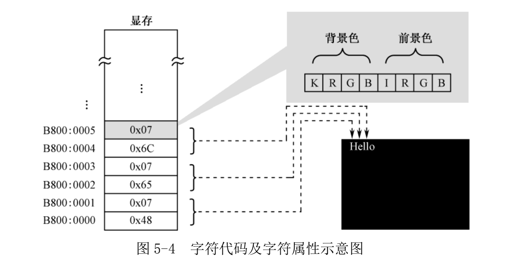
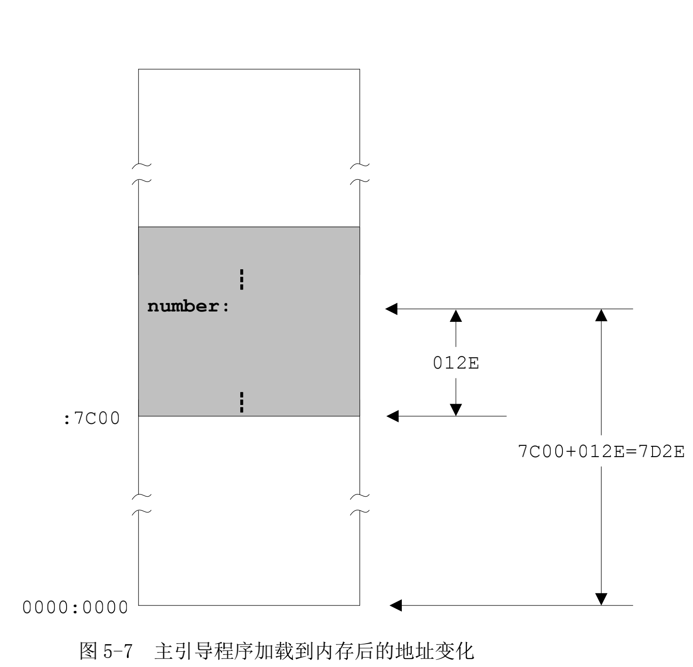
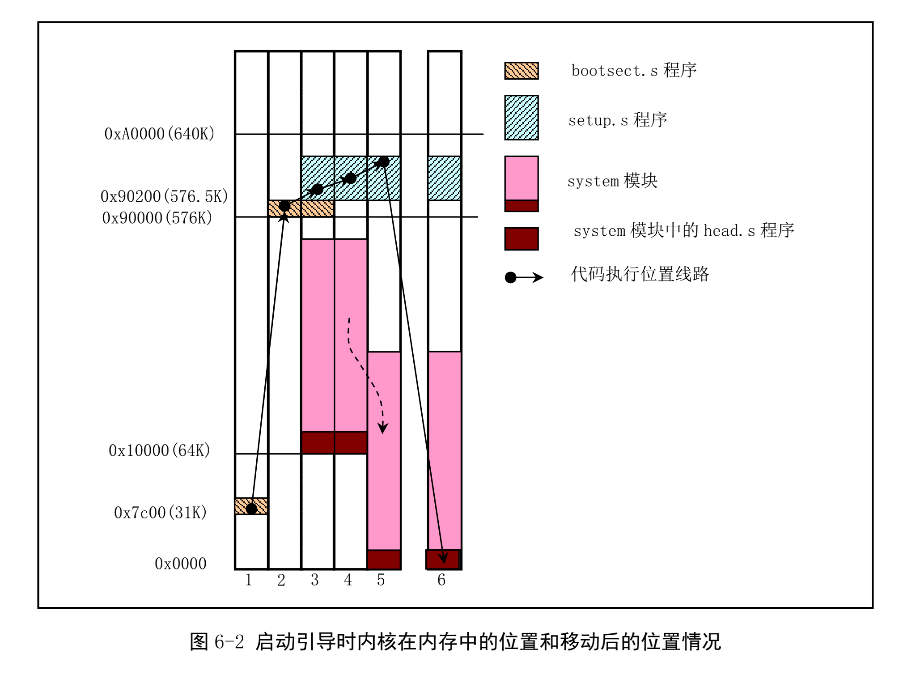

# 《x86汇编语言：从实模式到保护模式》

## 第五章---编写主引导扇区代码 分析

### 样例程序

```assembly
         ;代码清单5-1 
         ;文件名：c05_mbr.asm
         ;文件说明：硬盘主引导扇区代码
         ;创建日期：2011-3-31 21:15 
         
         mov ax,0xb800                 ;指向文本模式的显示缓冲区
         mov es,ax
 
         ;以下显示字符串"Label offset:"
         mov byte [es:0x00],'L'
         mov byte [es:0x01],0x07
         mov byte [es:0x02],'a'
         mov byte [es:0x03],0x07
         mov byte [es:0x04],'b'
         mov byte [es:0x05],0x07
         mov byte [es:0x06],'e'
         mov byte [es:0x07],0x07
         mov byte [es:0x08],'l'
         mov byte [es:0x09],0x07
         mov byte [es:0x0a],' '
         mov byte [es:0x0b],0x07
         mov byte [es:0x0c],'o'
         mov byte [es:0x0d],0x07
         mov byte [es:0x0e],'f'
         mov byte [es:0x0f],0x07
         mov byte [es:0x10],'f'
         mov byte [es:0x11],0x07
         mov byte [es:0x12],'s'
         mov byte [es:0x13],0x07
         mov byte [es:0x14],'e'
         mov byte [es:0x15],0x07
         mov byte [es:0x16],'t'
         mov byte [es:0x17],0x07
         mov byte [es:0x18],':'
         mov byte [es:0x19],0x07
 
         mov ax,number                 ;取得标号number的偏移地址
         mov bx,10
 
         ;设置数据段的基地址
         mov cx,cs
         mov ds,cx
 
         ;求个位上的数字
         mov dx,0
         div bx
         mov [0x7c00+number+0x00],dl   ;保存个位上的数字
 
         ;求十位上的数字
         xor dx,dx
         div bx
         mov [0x7c00+number+0x01],dl   ;保存十位上的数字
 
         ;求百位上的数字
         xor dx,dx
         div bx
         mov [0x7c00+number+0x02],dl   ;保存百位上的数字
 
         ;求千位上的数字
         xor dx,dx
         div bx
         mov [0x7c00+number+0x03],dl   ;保存千位上的数字
 
         ;求万位上的数字 
         xor dx,dx
         div bx
         mov [0x7c00+number+0x04],dl   ;保存万位上的数字
 
         ;以下用十进制显示标号的偏移地址
         mov al,[0x7c00+number+0x04]
         add al,0x30
         mov [es:0x1a],al
         mov byte [es:0x1b],0x04
         
         mov al,[0x7c00+number+0x03]
         add al,0x30
         mov [es:0x1c],al
         mov byte [es:0x1d],0x04
         
         mov al,[0x7c00+number+0x02]
         add al,0x30
         mov [es:0x1e],al
         mov byte [es:0x1f],0x04
 
         mov al,[0x7c00+number+0x01]
         add al,0x30
         mov [es:0x20],al
         mov byte [es:0x21],0x04
 
         mov al,[0x7c00+number+0x00]
         add al,0x30
         mov [es:0x22],al
         mov byte [es:0x23],0x04
         
         mov byte [es:0x24],'D'
         mov byte [es:0x25],0x07
          
   infi: jmp near infi                 ;无限循环
      
  number db 0,0,0,0,0
  
  times 203 db 0
            db 0x55,0xaa

```

#### 分析：

* 本例程序目的是在系统启动时，显示目标字符。

* 程序开始处的`mov ax,0xb800  mov es,ax`是将为将段寄存器指向显存起始地址。

* 之后的`mov byte [es:0x0i],'*'  mov byte [es:0x0(i+1)],0x07`，前者是将目标字符写入显存，后者是将目标字符的显示参数写入显存。这里的显示参数位b<sub>7</sub> ~ b<sub>0</sub>分别为：闪烁位，背景色的R、G、B，字符亮度位，字符的R、G、B。

  

  

* 接下来到`mov ax,number  mov bx,10`，开始`number`所在地址的十进制形式显示，这里我们需要对十六进制的地址形式进行分解。

* 这里采用的是32位/16位形式的除法，这种除法通常采用`DX:AX`的形式来表示32位的被除数，除完后的结果余数存储在`DX`中，商存储在`AX`中，此时我们将`BX`赋值为10，进行地址分解。

* 由于`number`的地址表示为16位，那么可以将高位的`DX`设置为全`0`参与运算。

* 在第一次执行了`div bx`后，余数存储在了`DX`中，由于寄存器`DX`还要参与之后的分解，此时我们将余数存储一个内存单元中(因为除数为10，那么他的余数的二进制表示自然不可能超过单个内存单元的长度，即一个字节)，该内存单元的地址我们设置为`0x7c00+number+0x00`，这里为什么要加上`0x7c00`？

  我们知道在处理器上电之后，自动进入实模式，首先启动`Bios`初始化程序，会在物理内存开始处放置一个大小为`0x400`字节的中断向量表，之后开始读取引导扇区中的代码到内存的`0x7c00`中，那么我们的代码就会在此开始执行。我们知道`number`其实是一个相对地址，若是不加上绝对起始地址`0x7c00`，那我们的数据就有可能会覆盖掉低位内存单元中的重要数据。

  

  下图中的`bootsect.s`可对应我们的样例程序的在内存中的位置变化。

  

* 获取到十进制形式后，我们开始显示该字符，即将字符，及其显示参数写入显存中。

* 这里我们注意到`infi`这一标号，其代码的目的是让处理器在此处循环执行。`jmp near infi`中`near`是指在本段内，`infi`则是指本标号，意思是在本段内的`infi`循环。写入这一指令，就是为了让处理器停在此处循环执行，这样目标字符串则可以一直显示。

* 最后加上`times 203 db 0`是为了补足这一个扇区(512B)的开始到结束之间的剩余部分，最后的`0x55  0xaa`代表引导扇区的结束，这是必须添加的，否则会报错为无效引导扇区。


