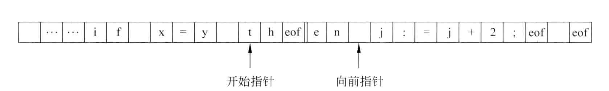

# 词法分析

---

1. 词法分析在编译过程中的定位

   * 词法分析作为独立的一遍：

     ```mermaid
     graph LR
     A[字符串源程序]==字符====>B[词法分析程序]==记号====>C[记号流源程序]
     
     ```

     将词法分析程序分离，便于语法分析程序专注于语法处理，简化设计；不用考虑上层分析程序，可构造更有效的词法分析程序，提高效率；同时也加强了编译程序的的可移植性。

   * 词法分析作为语法分析的子程序：

     ```mermaid
     graph LR
     A[字符串源程序]==字符====>B[词法分析程序]==记号====>C[语法分析程序]
     C==取下一记号===>B
     B-->D[符号表]
     
     
     ```

     避免了中间文件的产生；省去了取送符号的操作；提高编译程序的效率。

   * 词法分析与语法分析作为协同程序，两者处于同一遍中，交叉进行，以生产者和消费者的关系同时进行。

     

2. 词法分析程序的输入

   双缓冲输入模式的介绍：

   

   缓冲区分为左右两半，开始指针和向前指针在初始阶段都指向下一个单词符号的起始字符，之后向前指针向前扫描，当向前指针到达左半区的终点时，则填充右半区，即将原先左半区开始指针到向前指针之间的内容移动到右半区来；当向前指针到达右半区的终点时，则填充左半区，注意左右半区是首尾连接的循环结构。

   

   缓冲和单词的关系：

   

   在左右半区终点处添加了eof标记后，这里给出伪代码：

   ```C
   while(...)
   {
     向前指针移动一个位置
     if(向前指针指向EOF)
     {
       if(向前指针在左半区的终点)
       {
         向前指针向前移动一个位置	// 离开左半区的终点
         填充右半区
       }
       else if(向前指针在右半区终点)
       {
         向前指针指向缓冲区的开始位置
         填充左半区
       }
       else
       {
         终止词法分析
       }
     }  
   }
   ```

   

3. 词法分析程序的输出——记号

   记号的种类：1. 关键字；2. 标识符；3. 常数；4. 运算符；5. 分界符。

   分析出记号的方式：记号的模式，如记号的正则式。

   词法分析的结果：记号和其对应的属性。

   不同的记号的属性：

   1. 标识符：符号表中的入口地址；
   2. 常数：表示的值；
   3. 关键字：一符一种，不同的关键字属性也不同，需要各个区分；
   4. 运算符：一符一种；
   5. 分界符：一符一种。

   记号的文法表示，如下：

   > 标识符：$id\rightarrow letter \ rid\\ rid \rightarrow\epsilon\ |\ digit\ rid\ |\ letter\ rid$
   >
   > 
   >
   > 常数——整数：$digits \rightarrow digit\ |\ digits\ digit$
   >
   > 
   >
   > 常数——无符号数：$num\rightarrow digits\ optional\_fraction\ optional\_exponent\\optional\_fraction \rightarrow (.digits)? \\optional\_exponent\rightarrow(E(+|-)?digits)?$
   >
   > 
   >
   > 其右线性文法表达式为：$num\rightarrow digit\ num1\\num1\rightarrow digit\ num1\ |\ .\ num2\ |\ E\ num4\ |\ \epsilon\\num2\rightarrow digit\ num3\\num3\rightarrow digit\ num3\ |\ E\ num4\ |\ \epsilon\\num4\rightarrow+\ digits\ |\ -\ digits\ |\ digits$
   >
   > 运算符——关系运算符：$relop\rightarrow\ <\ |\ <= \ |\ ==\ |\ >\ |\ >=$
   >
   > 运算符——赋值号：$assign\_option\rightarrow\ =$
   >
   > 运算符——算术运算符：$single\rightarrow\ +\ |\ -\ |\ *\ |\ /\ |\ (\ |\ )\ |\ :\ |\ '\ |\ ;$
   >

   这里给出设计的状态转换图：

   > 注意：
   >
   > 1. 这里的标识符在识别后会进入关键字表中查询，如果查找到，则记录为关键字。
   >
   > 2. 这里的浅红色的标记，表示该代码串被该模式分支识别；这里的深红色标记，表示该模式分支无法识别该代码串。

   .png)

   这里给出关于C语言的词法分析程序（由于这里考虑的是C语言中的主要词法，程序可能存在某些不完善之处）：

   * words_analysis.h

     ```C
     #ifndef _WORDS_ANALYSIS_H_
     #define _WORDS_ANALYSIS_H_
     #include <stdio.h>
     #include <stdlib.h>
     #include <stdbool.h>
     #include <string.h>
     #include <fcntl.h>
     #include <unistd.h>
     #define ulong   unsigned long long int
     #define uint    unsigned int
     /*------ relation operators ------*/
     #define OPERATOR     0 
     #define LT      11
     #define LE      12
     #define GT      13
     #define GE      14
     #define EQ      15
     
     /*------ assign operators ------*/
     #define AS      16
     
     
     /*------ algorithm operators ------*/
     #define ADD     17
     #define DEC     18
     #define MUL     19
     #define DIV     20
     #define LB      21
     #define RB      22
     #define BLB     23
     #define BRB     24
     #define AND     25
     #define OR      26
     #define NOT     27
     #define XOR     28
     #define REVS    29
     #define SQUT    30
     #define QUT     31
     #define MLB     32
     #define MRB     33
     #define SHL     34
     #define SHR     35
     #define COLON   36
     /*------ keywords ------*/
     #define KEYWORD     1
     #define IF      41
     #define ELSE    42
     #define WHILE   43
     #define SWITCH  44
     #define CASE    45
     #define BREAK   46
     
     #define FOR     47
     #define VOID    48
     #define UNSIG   49
     #define CHAR    50
     #define SHORT   51
     #define INT     52
     #define FLOAT   53
     #define LONG    54
     #define DOUBLE  55
     #define STATIC  56
     #define EXTERN  57
     #define CONTIU  58
     
     /*------ constant ------*/
     #define CONSTANT    2
     #define NUM     61
     #define STR     62
     #define CHR     63
     
     /*------ identifier ------*/
     #define ID      3
     
     
     /*------ separator ------*/
     #define SEPARATOR   4
     #define SEMCOL  71
     #define COMMA   72
     
     
     /*------ comment ------*/
     #define COMMENT 5
     #define SCMT    80
     #define MCMT    81
     
     
     /*------ whitespace ------*/
     #define BLANK   6
     #define FEED    7
     #define TAB     8
     
     /*------ error ------*/
     #define ERROR   9
     
     #define ILLEG   100
     #define OTHER   110
     
     // 关键字表大小
     const static uint keywds_table_size = 20;
     // 关键字表
     const static char *keywds_table[] = {"if", "else", "when",
                 "switch", "case", "for", "void", "char",
                 "unsigned", "int", "short", "long", "float",
                 "double", "return","extern","static", "const",
                 "break", "continue"
             };
     
     const static char *types[] = {"operator", "keyword", "constant", 
                 "identifier", "separator", "comment", "whitspace"
             };
     
     
     // 判断当前字符是否为字母或下划线
     bool is_letter();
     // 判断当前字符是否为数字
     bool is_digit();
     // 判断当前单词是否为关键字
     bool is_keywd();
     // 判断当前字符是否为非换行符
     bool is_chr();
     // buffer后退一个字符
     int retract();
     // 从buffer中读取字符
     int get_char();
     // 将当前字符连接到当前单词后
     int cat();
     // 判断自动机分支
     char branch();
     // 将当前单词的属性进行封装，并提交到单词表
     int fetch_word(uint type);
     // 初始化单词缓冲区buffer和token
     int init_buffer(char *filepath);
     // 词法分析
     int analysis();
     // 词法分析结束判断
     bool done();
     // 输出结果统计信息
     void print_statistics();
     
     /*---------------- analysis_state.c ----------------*/
     void state_0();
     void state_1();
     void state_2();
     void state_3();
     void state_4();
     void state_5();
     void state_6();
     void state_7();
     void state_8();
     void state_9();
     void state_10();
     void state_11();
     void state_12();
     void state_13();
     void state_14();
     void state_15();
     void state_16();
     void state_17();
     void state_18();
     void state_19();
     void state_20();
     void state_21();
     void state_22();
     void state_23();
     void state_24();
     void state_25();
     void state_26();
     void state_27();
     void state_28();
     void state_29();
     void state_30();
     void state_31();
     void state_32();
     void state_33();
     void state_34();
     void state_35();
     void state_36();
     void state_37();
     void state_38();
     void state_39();
     
     #endif
     ```

   * words_analysis.c

     ```C
     #include "words_analysis.h"
     #include "words_table.h"
     #define IS_LETTER 65
     #define IS_DIGIT 48
     
     const static ulong buf_size = 1024 * 1024;
     const static ulong tok_size = 1024;
     static int fd;
     static ulong code_size;
     static char buffer[buf_size];
     static char token[tok_size];
     static ulong tok_len;
     static char *begin;
     static char *forward;
     static struct word tempwd;
     
     // 字符个数
     ulong chars_cnt = 0;
     // 行数
     ulong line_cnt = 1;
     // 单词个数
     ulong words_cnt = 0;
     // 常量个数
     ulong consts_cnt = 0;
     // 标识符个数
     ulong ids_cnt = 0;
     // 关键字个数
     ulong keywds_cnt = 0;
     // 运算符个数
     ulong opts_cnt = 0;
     // 分隔符个数
     ulong septs_cnt = 0;
     // 注释个数
     ulong cmts_cnt = 0;
     // 空格个数
     ulong blks_cnt = 0;
     // 换行符个数
     ulong lfds_cnt = 0;
     // 制表符个数
     ulong tabs_cnt = 0;
     // 错误个数
     ulong errs_cnt = 0;
     // 当前列号
     ulong current_row = 1;
     // 状态序号
     uint state = 0;
     // 当前读取的字符
     char C;
     
     
     bool is_letter()
     {
         if((C <= 'Z' && C >= 'A') || (C >= 'a' && C <= 'z') || C == '_')
         {
             return true;
         }
         return false;
     }
     
     bool is_digit()
     {
     
         if(C <= '9' && C >= '0')
         {
             return true;
         }
         return false;
     }
     
     bool is_chr()
     {
         if(C == '\n')
         {
             return false;
         }
         return true;
     }
     
     bool is_keywd()
     {
         bool flag = true;
         for(int i = 0; i < keywds_table_size && flag; i++)
         {
             if(strcmp(token, keywds_table[i]) == 0)
             {
                 flag = false;
             }
         }
         if(flag == false)
         {
             return true;
         }
         return false;
     }
     
     int init_buffer()
     {
         // 打开文件
         fd = open("example.c", O_RDONLY);
         // 读取文件数据
         code_size = read(fd, buffer, buf_size);
         // 初始化开始和向前指针
         tok_len = 0;
         begin = buffer;
         forward = begin;
         // 关闭文件
         close(fd);
         return 0;
     }
     
     
     int get_char()
     {
         C = *forward;
         forward++;
         chars_cnt++;
         current_row++;
         if(chars_cnt >= code_size)
         {
             return -1;
         }
         return 0;
     }
     
     int cat()
     {
         token[tok_len] = C;
         tok_len++;
         return 0;
     }
     
     int fetch_word(uint type)
     {
         switch (type)
         {
             case OPERATOR:  opts_cnt++; words_cnt++;    break;
             case KEYWORD:   keywds_cnt++; words_cnt++;  break;
             case CONSTANT:  consts_cnt++; words_cnt++;  break;
             case ID:    ids_cnt++; words_cnt++;  break;
             case SEPARATOR: septs_cnt++; words_cnt++;    break;
             case COMMENT:   cmts_cnt++; break;
             case BLANK: blks_cnt++; break;
             case FEED:  lfds_cnt++; break;
             case TAB:   tabs_cnt++; break;
             case ERROR: errs_cnt++; break;
         }
         tempwd.type = type;
         tempwd.lineno = line_cnt;
         tempwd.rowno = current_row;
         strcpy(tempwd.value, token);
         insert_table(&tempwd);
         memset(token, 0, tok_len);
         tok_len = 0;
         return 0;
     }
     
     int main(int argc, char *argv[])
     {
         init_buffer();
         init_words_table();
         // do {
         //     get_char();
         //     printf("%c", C);
         // } while(!done());
         analysis();
         print_table();
         print_statistics();
         return 0;
     }
     
     char branch()
     {
         if(is_letter())
         {
             return IS_LETTER;
         }
         else if(is_digit())
         {
             return IS_DIGIT;
         }
         return C;
     }
     
     int retract()
     {
         forward--;
         current_row--;
         chars_cnt--;
         return 0;
     }
     
     bool done()
     {
         if(chars_cnt <= code_size)
         {
             return false;
         }
         return true;
     }
     
     int analysis()
     {
         state = 0;
         while(!done())
         {
             // printf("code size\t%llu  chars_cnt\t%llu",code_size,chars_cnt);
             switch (state)
             {
                 case 0: state_0();  break;
                 case 1: state_1();  break;
                 case 2: state_2();  break;
                 case 3: state_3();  break;
                 case 4: state_4();  break;
                 case 5: state_5();  break;
                 case 6: state_6();  break;
                 case 7: state_7();  break;
                 case 8: state_8();  break;
                 case 9: state_9();  break;
                 case 10: state_10();  break;
                 case 11: state_11();  break;
                 case 12: state_12();  break;
                 case 13: state_13();  break;
                 case 14: state_14();  break;
                 case 15: state_15();  break;
                 case 16: state_16();  break;
                 case 17: state_17();  break;
                 case 18: state_18();  break;
                 case 19: state_19();  break;
                 case 20: state_20();  break;
                 case 21: state_21();  break;
                 case 22: state_22();  break;
                 case 23: state_23();  break;
                 case 24: state_24();  break;
                 case 25: state_25();  break;
                 case 26: state_26();  break;
                 case 27: state_27();  break;
                 case 28: state_28();  break;
                 case 29: state_29();  break;
                 case 30: state_30();  break;
                 case 31: state_31();  break;
                 case 32: state_32();  break;
                 case 33: state_33();  break;
                 case 34: state_34();  break;
                 case 35: state_35();  break;
                 case 36: state_36();  break;
                 case 37: state_37();  break;
                 case 38: state_38();  break;
                 case 39: state_39();  break;
             }
         }
         return 0;
     }
     
     void print_statistics()
     {
         printf("-----------------------------\n");
         printf(" Words Analysis Statistics: \n");
         printf("-----------------------------\n");
         printf("* line count    \t%llu\n", line_cnt);
         printf("* character count\t%llu\n", chars_cnt);
         printf("* word count    \t%llu\n", words_cnt);
         printf("* operator count\t%llu\n", opts_cnt);
         printf("* constant count\t%llu\n", consts_cnt);
         printf("* identifier count\t%llu\n", ids_cnt);
         printf("* keywords count\t%llu\n", keywds_cnt);
         printf("* separator count\t%llu\n", septs_cnt);
         printf("* comment count \t%llu\n",cmts_cnt);
         printf("* blank count   \t%llu\n",blks_cnt);
         printf("* line feed count\t%llu\n",lfds_cnt);
         printf("* tab count     \t%llu\n", tabs_cnt);
         printf("* error count   \t%llu\n",errs_cnt);
         printf("-----------------------------\n");
     
     }
     ```

   * words_table.h

     ```C
     #ifndef _WORDS_TABLE_H_
     #define _WORDS_TABLE_H_
     #include <stdio.h>
     #include <stdbool.h>
     #define ulong unsigned long long int
     #define uint  unsigned int
     const static ulong max_entry = 1024 * 8;
     const static uint value_max_len = 1024;
     
     struct word
     {
         // 单词的类别
         uint type;
         // 单词所在行数
         uint lineno;
         // 单词所在列数
         uint rowno;
         // 单词的值
         char value[value_max_len];
     };
     
     // 初始化单词表
     int init_words_table();
     // 向单词表中插入某个单词表项
     int insert_table(struct word *unit);
     // 打印单词表中的所有内容
     int print_table();
     #endif
     ```

   * words_table.c

     ```c
     #include "words_table.h"
     
     char *types[] = {"operator", "keyword", "constant", 
                 "identifier", "separator", "comment",
                 "blankspace", "linefeed", "tab", "error"
             };
     
     static struct word words_table[max_entry];
     static uint current;
     
     int init_words_table()
     {
         current = 0;
         return 0;
     }
     
     
     int insert_table(struct word *unit)
     {
         words_table[current] = *unit;
         current++;
         return 0;
     }
     
     int print_table()
     {
         for(int i = 0; i < current; i++)
         {
             printf("%d:%d <%s,\"%s\">\n", words_table[i].lineno, words_table[i].rowno, types[words_table[i].type], words_table[i].value);
         }
         return 0;
     }
     ```

   * analysis_state.c

     ```C
     #include "words_analysis.h"
     #include "words_table.h"
     #define IS_LETTER 65
     #define IS_DIGIT 48
     
     const static ulong buf_size = 1024 * 1024;
     const static ulong tok_size = 1024;
     static int fd;
     static ulong code_size;
     static char buffer[buf_size];
     static char token[tok_size];
     static ulong tok_len;
     static char *begin;
     static char *forward;
     static struct word tempwd;
     
     // 字符个数
     ulong chars_cnt = 0;
     // 行数
     ulong line_cnt = 1;
     // 单词个数
     ulong words_cnt = 0;
     // 常量个数
     ulong consts_cnt = 0;
     // 标识符个数
     ulong ids_cnt = 0;
     // 关键字个数
     ulong keywds_cnt = 0;
     // 运算符个数
     ulong opts_cnt = 0;
     // 分隔符个数
     ulong septs_cnt = 0;
     // 注释个数
     ulong cmts_cnt = 0;
     // 空格个数
     ulong blks_cnt = 0;
     // 换行符个数
     ulong lfds_cnt = 0;
     // 制表符个数
     ulong tabs_cnt = 0;
     // 错误个数
     ulong errs_cnt = 0;
     // 当前列号
     ulong current_row = 1;
     // 状态序号
     uint state = 0;
     // 当前读取的字符
     char C;
     
     
     bool is_letter()
     {
         if((C <= 'Z' && C >= 'A') || (C >= 'a' && C <= 'z') || C == '_')
         {
             return true;
         }
         return false;
     }
     
     bool is_digit()
     {
     
         if(C <= '9' && C >= '0')
         {
             return true;
         }
         return false;
     }
     
     bool is_chr()
     {
         if(C == '\n')
         {
             return false;
         }
         return true;
     }
     
     bool is_keywd()
     {
         bool flag = true;
         for(int i = 0; i < keywds_table_size && flag; i++)
         {
             if(strcmp(token, keywds_table[i]) == 0)
             {
                 flag = false;
             }
         }
         if(flag == false)
         {
             return true;
         }
         return false;
     }
     
     int init_buffer(char *filepath)
     {
         // 打开文件
         fd = open(filepath, O_RDONLY);
         // 读取文件数据
         code_size = read(fd, buffer, buf_size);
         // 初始化开始和向前指针
         tok_len = 0;
         begin = buffer;
         forward = begin;
         // 关闭文件
         close(fd);
         return 0;
     }
     
     
     int get_char()
     {
         C = *forward;
         forward++;
         chars_cnt++;
         current_row++;
         if(chars_cnt >= code_size)
         {
             return -1;
         }
         return 0;
     }
     
     int cat()
     {
         token[tok_len] = C;
         tok_len++;
         return 0;
     }
     
     int fetch_word(uint type)
     {
         switch (type)
         {
             case OPERATOR:  opts_cnt++; words_cnt++;    break;
             case KEYWORD:   keywds_cnt++; words_cnt++;  break;
             case CONSTANT:  consts_cnt++; words_cnt++;  break;
             case ID:    ids_cnt++; words_cnt++;  break;
             case SEPARATOR: septs_cnt++; words_cnt++;    break;
             case COMMENT:   cmts_cnt++; break;
             case BLANK: blks_cnt++; break;
             case FEED:  lfds_cnt++; break;
             case TAB:   tabs_cnt++; break;
             case ERROR: errs_cnt++; break;
         }
         tempwd.type = type;
         tempwd.lineno = line_cnt;
         tempwd.rowno = current_row;
         strcpy(tempwd.value, token);
         insert_table(&tempwd);
         memset(token, 0, tok_len);
         tok_len = 0;
         return 0;
     }
     
     int main(int argc, char *argv[])
     {
         if(argc != 3 || strcmp(argv[1],"-s"))
         {
             printf("arguement error!\n");
             printf("format: -s ${source filepath}!\n");
             return -1;
         }
         init_buffer(argv[2]);
         init_words_table();
         analysis();
         print_table();
         print_statistics();
         return 0;
     }
     
     char branch()
     {
         if(is_letter())
         {
             return IS_LETTER;
         }
         else if(is_digit())
         {
             return IS_DIGIT;
         }
         return C;
     }
     
     int retract()
     {
         forward--;
         current_row--;
         chars_cnt--;
         return 0;
     }
     
     bool done()
     {
         if(chars_cnt <= code_size)
         {
             return false;
         }
         return true;
     }
     
     int analysis()
     {
         state = 0;
         while(!done())
         {
             switch (state)
             {
                 case 0: state_0();  break;
                 case 1: state_1();  break;
                 case 2: state_2();  break;
                 case 3: state_3();  break;
                 case 4: state_4();  break;
                 case 5: state_5();  break;
                 case 6: state_6();  break;
                 case 7: state_7();  break;
                 case 8: state_8();  break;
                 case 9: state_9();  break;
                 case 10: state_10();  break;
                 case 11: state_11();  break;
                 case 12: state_12();  break;
                 case 13: state_13();  break;
                 case 14: state_14();  break;
                 case 15: state_15();  break;
                 case 16: state_16();  break;
                 case 17: state_17();  break;
                 case 18: state_18();  break;
                 case 19: state_19();  break;
                 case 20: state_20();  break;
                 case 21: state_21();  break;
                 case 22: state_22();  break;
                 case 23: state_23();  break;
                 case 24: state_24();  break;
                 case 25: state_25();  break;
                 case 26: state_26();  break;
                 case 27: state_27();  break;
                 case 28: state_28();  break;
                 case 29: state_29();  break;
                 case 30: state_30();  break;
                 case 31: state_31();  break;
                 case 32: state_32();  break;
                 case 33: state_33();  break;
                 case 34: state_34();  break;
                 case 35: state_35();  break;
                 case 36: state_36();  break;
                 case 37: state_37();  break;
                 case 38: state_38();  break;
                 case 39: state_39();  break;
             }
         }
         return 0;
     }
     
     void print_statistics()
     {
         printf("-----------------------------\n");
         printf(" Words Analysis Statistics: \n");
         printf("-----------------------------\n");
         printf("* line count    \t%llu\n", line_cnt);
         printf("* character count\t%llu\n", chars_cnt);
         printf("* word count    \t%llu\n", words_cnt);
         printf("* operator count\t%llu\n", opts_cnt);
         printf("* constant count\t%llu\n", consts_cnt);
         printf("* identifier count\t%llu\n", ids_cnt);
         printf("* keywords count\t%llu\n", keywds_cnt);
         printf("* separator count\t%llu\n", septs_cnt);
         printf("* comment count \t%llu\n",cmts_cnt);
         printf("* blank count   \t%llu\n",blks_cnt);
         printf("* line feed count\t%llu\n",lfds_cnt);
         printf("* tab count     \t%llu\n", tabs_cnt);
         printf("* error count   \t%llu\n",errs_cnt);
         printf("-----------------------------\n");
     
     }
     ```
     
   * 这里给出测试用例：
   
   * example.c
   
     ```c
     /*  example.c  */
     double a = 1.e1;
     double b = 1.e2;
     // error
     double c = 1.e;
     // main
     int main(void)
     {
         a = a * b;
         a = a + b;
     }
     ```
   
   * 给出编译运行脚本
   
   * compile-C.sh
   
     ```shell
     gcc words_analysis.c words_table.c analysis_state.c -o words_analysis
     ./words_analysis
     ```
   
   * 运行结果：
   
     ```json
     1:18 <comment,"/*  example.c  */">
     1:19 <linefeed,"
     ">
     2:7 <keyword,"double">
     2:8 <blankspace," ">
     2:9 <identifier,"a">
     2:10 <blankspace," ">
     2:11 <operator,"=">
     2:12 <blankspace," ">
     2:16 <constant,"1.e1">
     2:17 <separator,";">
     2:18 <linefeed,"
     ">
     3:7 <keyword,"double">
     3:8 <blankspace," ">
     3:9 <identifier,"b">
     3:10 <blankspace," ">
     3:11 <operator,"=">
     3:12 <blankspace," ">
     3:16 <constant,"1.e2">
     3:17 <separator,";">
     3:18 <linefeed,"
     ">
     5:1 <comment,"// error
     ">
     5:7 <keyword,"double">
     5:8 <blankspace," ">
     5:9 <identifier,"c">
     5:10 <blankspace," ">
     5:11 <operator,"=">
     5:12 <blankspace," ">
     5:16 <error,"1.e;">
     5:17 <linefeed,"
     ">
     7:1 <comment,"// main
     ">
     7:4 <keyword,"int">
     7:5 <blankspace," ">
     7:9 <identifier,"main">
     7:10 <operator,"(">
     7:14 <keyword,"void">
     7:15 <operator,")">
     7:16 <linefeed,"
     ">
     8:2 <operator,"{">
     8:3 <linefeed,"
     ">
     9:2 <blankspace," ">
     9:3 <blankspace," ">
     9:4 <blankspace," ">
     9:5 <blankspace," ">
     9:6 <identifier,"a">
     9:7 <blankspace," ">
     9:8 <operator,"=">
     9:9 <blankspace," ">
     9:10 <identifier,"a">
     9:11 <blankspace," ">
     9:12 <operator,"*">
     9:13 <blankspace," ">
     9:14 <identifier,"b">
     9:15 <separator,";">
     9:16 <linefeed,"
     ">
     10:2 <blankspace," ">
     10:3 <blankspace," ">
     10:4 <blankspace," ">
     10:5 <blankspace," ">
     10:6 <identifier,"a">
     10:7 <blankspace," ">
     10:8 <operator,"=">
     10:9 <blankspace," ">
     10:10 <identifier,"a">
     10:11 <blankspace," ">
     10:12 <operator,"+">
     10:13 <blankspace," ">
     10:14 <identifier,"b">
     10:15 <separator,";">
     10:16 <linefeed,"
     ">
     11:2 <operator,"}">
     -----------------------------
      Words Analysis Statistics: 
     -----------------------------
     * line count            11
     * character count       134
     * word count            32
     * operator count        11
     * constant count        2
     * identifier count      10
     * keywords count        5
     * separator count       4
     * comment count         3
     * blank count           26
     * line feed count       8
     * tab count             0
     * error count           1
     -----------------------------
     ```
   
   以上是使用C语言编写的词法分析程序，现在使用LEX编写词法分析器生成程序。
   
   这里按照C语言语法给出各种记号的正则表达式：
   
   ```js
   /*  基本元素 basic  */
   	// 换行符和空白符
   	delim		[ \n\t]
   	// 空白区域
   	ws			[delim]+
   	// 字母和下划线
   	letter	[A-Za-z_]
   	// 数字
   	digit		[0-9]
   
   
   /*  常量 constant  */
   	// 定点数
   	number	[+-]?{digit}+([\.]{digit}+)?([Ee][+-]?{digit}+)?
   	// 字符串
   	str			("[\s\S]*")
   	// 字符
   	chr			('[\s\S]?')
   
   
   /*  标识符 identifier  */
   id			{letter}[{letter}{digit}]*
   
     
   /*  运算符 operator  */
   	// +,-,*,/,(,){,},%,&,|,^,!,~,=,<,>,<=,>=,==,:
   	// 由于运算符语法是固定的，故不需要使用正则表达式描述，直接使用字符串描述即可
   
   /*  关键字 keyword  */
     // if,else,when,for,do,void,unsigned,char,short,int,float,long,double,return,
     // switch,case,break,static,extern,const,continue
   	// 由于关键字语法是固定的，故不需要使用正则表达式描述，直接使用字符串描述即可
     
     
   /*  分隔符 separator  */
     // ,和;
     // 由于分隔符语法是固定的，故不需要使用正则表达式描述，直接使用字符串描述即可
   
   
   /*  注释 comment  */
   	// 单行注释
     sgl_cmt		(//[\s\S]*)
     // 多行注释，限制符后跟？，表示最短匹配
   	mul_cmt		(/\*(.|\s)*?\*/)
   ```
   
   这里给出LEX程序：
   
   * words_analysis.l
   
     ```C
     %{
     #include <stdio.h>
     #include <stdlib.h>
     
     /*------ relation operators ------*/
     #define LT      1
     #define LE      2
     #define GT      3
     #define GE      4 
     #define EQ      5
     
     /*------ assign operators ------*/
     #define AS      6
     
     
     /*------ algorithm operators ------*/
     #define ADD     7
     #define DEC     8
     #define MUL     9
     #define DIV     10
     #define LB      11
     #define RB      12
     #define BLB     13
     #define BRB     14
     #define AND     15
     #define OR      16
     #define NOT     17
     #define XOR     18
     #define REVS    19
     #define SQUT    20
     #define QUT     21
     #define MLB     22
     #define MRB     23
     #define SHL     24
     #define SHR     25
     #define COLON   26
     /*------ keywords ------*/
     #define IF      30
     #define ELSE    31
     #define WHILE   32
     #define SWITCH  33
     #define CASE    34
     #define BREAK   35
     
     #define FOR     36
     #define VOID    37
     #define UNSIG   38
     #define CHAR    39
     #define SHORT   40
     #define INT     41
     #define FLOAT   42
     #define LONG    43
     #define DOUBLE  44
     #define STATIC  45
     #define EXTERN  46
     #define CONTIU  47
     
     /*------ constant ------*/
     #define NUM     50
     #define STR     51
     #define CHR     52
     
     /*------ whitespace ------*/
     #define WS      53
     
     
     /*------ identifier ------*/
     #define ID      54
     
     /*------ comment ------*/
     #define SCMT    55
     #define MCMT    56
     
     /*------ separator ------*/
     #define SEMCOL  57
     #define COMMA   58
     
     #define ILEG    90
     
     
     // 行数
     int line_cnt = 0;
     // 字符个数
     int chars_cnt = 0;
     // 单词个数
     int words_cnt = 0;
     // 常量个数
     int consts_cnt = 0;
     // 标识符个数
     int ids_cnt = 0;
     // 关键字个数
     int keywds_cnt = 0;
     // 运算符个数
     int opts_cnt = 0;
     // 分隔符个数
     int septs_cnt = 0;
     // 注释个数
     int cmts_cnt = 0;
     // 空白符个数
     int ws_cnt = 0;
     // 其他无法识别符号数
     int ilegs_cnt = 0;
     %}
     %option yylineno
     /*------ Regular Expressions ------*/
     
     delim       [ \t\n]
     ws          {delim}+
     digit       [0-9]
     letter      [A-Za-z_]
     id          {letter}({letter}|{digit})*
     /*  [+-]?[0-9]+([\.][0-9]+)?([Ee][+-]?[0-9]+)?   */
     /* number      [+-]?{digit}+([\.]{digit})?([Ee][+-]?[{digit}+)? */
     number      [+-]?[0-9]+[.]?([0-9]+)?([Ee][+-]?[0-9]+)?
     str         (\"(.*)\")
     chr         (\'[.]\')
     
     sgl_cmt     (\/\/.*[\n])
     mul_cmt     (\/\*((.|\n)*?)\*\/)
     
     others5     [^0-9+-]
     others6     [^0-9]
     illeg5      [+-]?[0-9]+[.]?([0-9]+)?([Ee]{others5})?
     illeg6      [+-]?[0-9]+[.]?([0-9]+)?([Ee][+-]?{others6})?
     
     
     /*------ modes and operations ------*/
     %%
     "<"         {return (LT);}
     "<="        {return (LE);}
     ">"         {return (GT);}
     ">="        {return (GE);}
     "=="        {return (EQ);}
     "<<"        {return (SHL);}
     ">>"        {return (SHR);}
     "+"         {return (ADD);}
     "-"         {return (DEC);}
     "*"         {return (MUL);}
     "/"         {return (DIV);}
     "("         {return (LB);}
     ")"         {return (RB);}
     "{"         {return (BLB);}
     "}"         {return (BRB);}
     "&"         {return (AND);}
     "|"         {return (OR);}
     "!"         {return (NOT);}
     "^"         {return (XOR);}
     "~"         {return (REVS);}
     "["         {return (MLB);}
     "]"         {return (MRB);}
     "\""        {return (QUT);}
     "'"         {return (SQUT);}
     ":"         {return (COLON);}
     "="         {return (AS);}
     
     "if"        {return (IF);}
     "else"      {return (ELSE);} 
     "while"     {return (WHILE);}
     "for"       {return (FOR);}
     "switch"    {return (SWITCH);}
     "case"      {return (CASE);}
     "break"     {return (BREAK);}
     "void"      {return (VOID);}
     "unsigned"  {return (UNSIG);}
     "char"      {return (CHAR);}
     "short"     {return (SHORT);}
     "int"       {return (INT);}
     "float"     {return (FLOAT);}
     "long"      {return (LONG);}
     "double"    {return (DOUBLE);}
     
     ";"         {return (SEMCOL);}
     ","         {return (COMMA);}
     
     
     {ws}        {return (WS);}
     
     
     {number}    {return (NUM);}
     {str}       {return (STR);}
     {chr}       {return (CHR);}
     
     
     {id}        {return (ID);}
     
     
     {sgl_cmt}   {return (SCMT);}
     {mul_cmt}   {return (MCMT);}
     
     {illeg5}    {return (ILEG);}
     {illeg6}    {return (ILEG);}
     %%
     
     void word_storge(int c)
     {
         switch(c)
         {
             case LT:opts_cnt++;fprintf(stdout, "%d: <operator:\t\"%s\">\n", yylineno, yytext);
                 break;
             case LE:opts_cnt++;fprintf(stdout, "%d: <operator:\t\"%s\">\n", yylineno, yytext);
                 break;
             case GT:
                 break;
             case GE:opts_cnt++;fprintf(stdout, "%d: <operator:\t\"%s\">\n", yylineno, yytext);
                 break;
             case EQ:opts_cnt++;fprintf(stdout, "%d: <operator:\t\"%s\">\n", yylineno, yytext);
                 break;
             case SHL:opts_cnt++;fprintf(stdout, "%d: <operator:\t\"%s\">\n", yylineno, yytext);
                 break;
             case SHR:opts_cnt++;fprintf(stdout, "%d: <operator:\t\"%s\">\n", yylineno, yytext);
                 break;   
             case ADD:opts_cnt++;fprintf(stdout, "%d: <operator:\t\"%s\">\n", yylineno, yytext);
                 break;
                 break;
             case DEC:opts_cnt++;fprintf(stdout, "%d: <operator:\t\"%s\">\n", yylineno, yytext);
                 break;
             case MUL:
                 break;
             case DIV:opts_cnt++;fprintf(stdout, "%d: <operator:\t\"%s\">\n", yylineno, yytext);
                 break;
             case LB:opts_cnt++;fprintf(stdout, "%d: <operator:\t\"%s\">\n", yylineno, yytext);
                 break;
             case RB:opts_cnt++;fprintf(stdout, "%d: <operator:\t\"%s\">\n", yylineno, yytext);
                 break;
             case BLB:opts_cnt++;fprintf(stdout, "%d: <operator:\t\"%s\">\n", yylineno, yytext);
                 break;
             case BRB:
                 break;
             case AND:opts_cnt++;fprintf(stdout, "%d: <operator:\t\"%s\">\n", yylineno, yytext);
                 break;
             case OR:opts_cnt++;fprintf(stdout, "%d: <operator:\t\"%s\">\n", yylineno, yytext);
                 break;
             case NOT:opts_cnt++;fprintf(stdout, "%d: <operator:\t\"%s\">\n", yylineno, yytext);
                 break;
             case XOR:opts_cnt++;fprintf(stdout, "%d: <operator:\t\"%s\">\n", yylineno, yytext);
                 break;
             case REVS:opts_cnt++;fprintf(stdout, "%d: <operator:\t\"%s\">\n", yylineno, yytext);
                 break;
             case AS:opts_cnt++;fprintf(stdout, "%d: <operator:\t\"%s\">\n", yylineno, yytext);
                 break;
             case SQUT:opts_cnt++;fprintf(stdout, "%d: <operator:\t\"%s\">\n", yylineno, yytext);
                 break;
             case QUT:opts_cnt++;fprintf(stdout, "%d: <operator:\t\"%s\">\n", yylineno, yytext);
                 break;
             case MLB:opts_cnt++;fprintf(stdout, "%d: <operator:\t\"%s\">\n", yylineno, yytext);
                 break;
             case MRB:opts_cnt++;fprintf(stdout, "%d: <operator:\t\"%s\">\n", yylineno, yytext);
                 break;
             case COLON:opts_cnt++;fprintf(stdout, "%d: <operator:\t\"%s\">\n", yylineno, yytext);
                 break;
     
             case IF:keywds_cnt++;fprintf(stdout, "%d: <keyword:\t\"%s\">\n", yylineno, yytext);
                 break;
             case ELSE:keywds_cnt++;fprintf(stdout, "%d: <keyword:\t\"%s\">\n", yylineno, yytext);
                 break;
             case WHILE:keywds_cnt++;fprintf(stdout, "%d: <keyword:\t\"%s\">\n", yylineno, yytext);
                 break;
             case FOR:keywds_cnt++;fprintf(stdout, "%d: <keyword:\t\"%s\">\n", yylineno, yytext);
                 break;
             case SWITCH:keywds_cnt++;fprintf(stdout, "%d: <keyword:\t\"%s\">\n", yylineno, yytext);
                 break;
             case CASE:keywds_cnt++;fprintf(stdout, "%d: <keyword:\t\"%s\">\n", yylineno, yytext);
                 break;
             case BREAK:keywds_cnt++;fprintf(stdout, "%d: <keyword:\t\"%s\">\n", yylineno, yytext);
                 break;
             case VOID:keywds_cnt++;fprintf(stdout, "%d: <keyword:\t\"%s\">\n", yylineno, yytext);
                 break;
             case UNSIG:keywds_cnt++;fprintf(stdout, "%d: <keyword:\t\"%s\">\n", yylineno, yytext);
                 break;
             case CHAR:keywds_cnt++;fprintf(stdout, "%d: <keyword:\t\"%s\">\n", yylineno, yytext);
                 break;
             case SHORT:keywds_cnt++;fprintf(stdout, "%d: <keyword:\t\"%s\">\n", yylineno, yytext);
                 break;
             case INT:keywds_cnt++;fprintf(stdout, "%d: <keyword:\t\"%s\">\n", yylineno, yytext);
                 break;
             case FLOAT:keywds_cnt++;fprintf(stdout, "%d: <keyword:\t\"%s\">\n", yylineno, yytext);
                 break;
             case LONG:keywds_cnt++;fprintf(stdout, "%d: <keyword:\t\"%s\">\n", yylineno, yytext);
                 break;
             case DOUBLE:keywds_cnt++;fprintf(stdout, "%d: <keyword:\t\"%s\">\n", yylineno, yytext);
                 break;
             case STATIC:keywds_cnt++;fprintf(stdout, "%d: <keyword:\t\"%s\">\n", yylineno, yytext);
                 break;
             case EXTERN:keywds_cnt++;fprintf(stdout, "%d: <keyword:\t\"%s\">\n", yylineno, yytext);
                 break;
             case CONTIU:keywds_cnt++;fprintf(stdout, "%d: <keyword:\t\"%s\">\n", yylineno, yytext);
                 break;
             
             case SEMCOL:septs_cnt++;fprintf(stdout, "%d: <separator:\t\"%s\">\n", yylineno, yytext);
                 break;
             case COMMA:septs_cnt++;fprintf(stdout, "%d: <separator:\t\"%s\">\n", yylineno, yytext);
                 break;
     
             case WS:ws_cnt = ws_cnt + yyleng;fprintf(stdout, "%d: <whitespace:\t\"%s\">\n", yylineno, yytext);
                 break;
     
             case NUM:consts_cnt++;fprintf(stdout, "%d: <constant:\t\"%s\">\n", yylineno, yytext);
                 break;
             case STR:consts_cnt++;fprintf(stdout, "%d: <constant:\t\"%s\">\n", yylineno, yytext);
                 break;
             case CHR:consts_cnt++;fprintf(stdout, "%d: <constant:\t\"%s\">\n", yylineno, yytext);
                 break;
     
             case ID:ids_cnt++;fprintf(stdout, "%d: <identifier:\t\"%s\">\n", yylineno, yytext);
                 break;
             
             case SCMT:cmts_cnt++;fprintf(stdout, "%d: <comment:\t\"%s\">\n", yylineno, yytext);
                 break;
             case MCMT:cmts_cnt++;fprintf(stdout, "%d: <comment:\t\"%s\">\n", yylineno, yytext);
                 break;
             case ILEG:ilegs_cnt++; fprintf(stdout, "%d: <illegal:\t\"%s\">\n", yylineno, yytext);
                 break;
         }
     }
     
     int yywrap() 
     { 
         return 1; 
     }
     
     void print_info()
     {
         printf("----------------------------\n");
         printf("+     lines count:     \t%d\n", line_cnt);
         printf("+     words count:     \t%d\n", words_cnt);
         printf("+     chars count:     \t%d\n", chars_cnt);
         printf("+     constant count:  \t%d\n", consts_cnt);
         printf("+     comment count:   \t%d\n", cmts_cnt);
         printf("+     keyword count:   \t%d\n", keywds_cnt);
         printf("+     operator count:  \t%d\n", opts_cnt);
         printf("+     separator count: \t%d\n", septs_cnt);
         printf("+     identifier count:\t%d\n", ids_cnt);
         printf("+     whitespace count:\t%d\n", ws_cnt);
     	printf("+     illegal count:\t%d\n", ilegs_cnt);
         printf("----------------------------\n");
     }
     
     
     int main(void)
     {
         yyin = fopen("example.c","r");
         int c = yylex();
         while(c)
         {
             word_storge(c);
             if(c != WS)
             {
                 words_cnt++;
             }
             chars_cnt = chars_cnt + yyleng;
             c = yylex();
         }
         line_cnt = yylineno;
         print_info();
         fclose(yyin);
         return 0;
     }
     ```
   
   * example.c
   
     ```C
     /*  example.c  */
     double a = 1.e1;
     double b = 1.e2;
     // error
     double c = 1.e;
     // main
     int main(void)
     {
         a = a * b;
         a = a + b;
     }
     ```
   
   * 编译运行脚本：`sh compile-lex.sh`
   
   * compile-lex.sh
   
     ```shell
     flex words_analysis.l
     gcc -o a.out lex.yy.c
     ./a.out
     ```
   
   * 运行结果：
   
     ```json
     1: <comment:    "/*  example.c  */">
     2: <whitespace: "
     ">
     2: <keyword:    "double">
     2: <whitespace: " ">
     2: <identifier: "a">
     2: <whitespace: " ">
     2: <operator:   "=">
     2: <whitespace: " ">
     2: <constant:   "1.e1">
     2: <separator:  ";">
     3: <whitespace: "
     ">
     3: <keyword:    "double">
     3: <whitespace: " ">
     3: <identifier: "b">
     3: <whitespace: " ">
     3: <operator:   "=">
     3: <whitespace: " ">
     3: <constant:   "1.e2">
     3: <separator:  ";">
     4: <whitespace: "
     ">
     5: <comment:    "// error
     ">
     5: <keyword:    "double">
     5: <whitespace: " ">
     5: <identifier: "c">
     5: <whitespace: " ">
     5: <operator:   "=">
     5: <whitespace: " ">
     5: <illegal:    "1.e;">
     6: <whitespace: "
     ">
     7: <comment:    "// main
     ">
     7: <keyword:    "int">
     7: <whitespace: " ">
     7: <identifier: "main">
     7: <operator:   "(">
     7: <keyword:    "void">
     7: <operator:   ")">
     8: <whitespace: "
     ">
     8: <operator:   "{">
     9: <whitespace: "
         ">
     9: <identifier: "a">
     9: <whitespace: " ">
     9: <operator:   "=">
     9: <whitespace: " ">
     9: <identifier: "a">
     9: <whitespace: " ">
     9: <whitespace: " ">
     9: <identifier: "b">
     9: <separator:  ";">
     10: <whitespace:        "
         ">
     10: <identifier:        "a">
     10: <whitespace:        " ">
     10: <operator:  "=">
     10: <whitespace:        " ">
     10: <identifier:        "a">
     10: <whitespace:        " ">
     10: <operator:  "+">
     10: <whitespace:        " ">
     10: <identifier:        "b">
     10: <separator: ";">
     11: <whitespace:        "
     ">
     ----------------------------
      Words Analysis Statistics: 
     ----------------------------
     +     lines count:      11
     +     words count:      36
     +     chars count:      133
     +     constant count:   2
     +     comment count:    3
     +     keyword count:    5
     +     operator count:   9
     +     separator count:  4
     +     identifier count: 10
     +     whitespace count: 34
     +     illegal count:    1
     ----------------------------
     ```
   
     